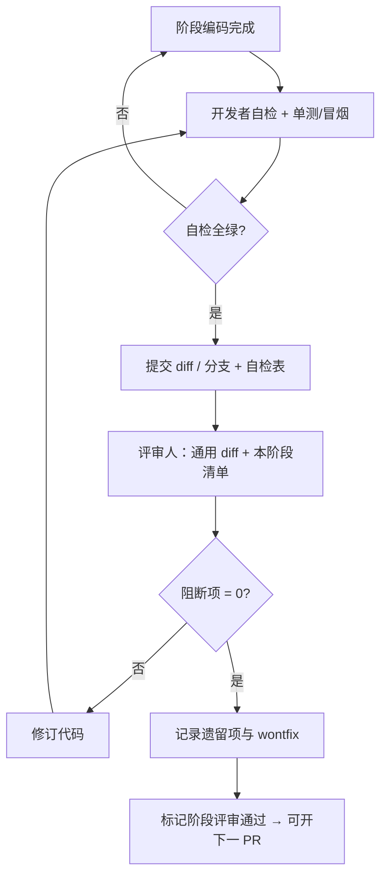

# AnchorTerm 多标签改造 — 分阶段代码评审方案

| 字段 | 内容 |
|------|------|
| **关联设计** | [UI-MULTI-TAB.md](UI-MULTI-TAB.md) |
| **适用范围** | PR1 → PR5 各阶段**编码完成后**的代码评审门禁 |
| **评审对象** | 该阶段 diff（相对上一已合入基线），而非全仓历史 |
| **状态** | Active |
| **日期** | 2026-07-25 |

---

## 1. 目的与原则

### 1.1 目的

1. 保证每阶段交付与 [UI-MULTI-TAB.md](UI-MULTI-TAB.md) 的 **Key Decisions / PR Plan** 一致。  
2. 防止多会话改造回归 README **会话沉淀** 中的硬约束（OpenSSH、mutex 锁顺序、cwd 恢复、凭据安全）。  
3. 在进入下一 PR 前，用**可勾选清单**收敛 critical/major 风险（串流、竞态、死锁、密钥残留）。  
4. 评审结论可追溯：问题分级、是否阻断合入、复评记录。

### 1.2 原则

| 原则 | 说明 |
|------|------|
| **阶段门禁** | 上一 PR 评审通过（或遗留项明确 wontfix / 下移）后才开下一 PR |
| **对照设计** | 评审以设计文档为「规格」；偏离须在评审记录中说明并更新设计或回改代码 |
| **证据优先** | 声称「已迁移 / 不串台」须有代码路径、单测或手工验收证据 |
| **小步可回滚** | PR1 禁止半吊子多会话；PR2 前后端同提交；禁止只升后端 |
| **安全零容忍** | 密码 / passphrase 明文落盘或进日志 → **阻断** |

### 1.3 与日常 `/review` 的关系

| 动作 | 时机 | 产出 |
|------|------|------|
| **阶段编码完成评审**（本方案） | 某 PR 编码 + 自测完成后 | 按本清单完整勾选 + 评审报告 |
| **日常 `/review`** | 任意局部改动 | 通用 diff 审查；**阶段门禁仍以本清单为准** |
| **手工验收** | PR3 起多会话 MS-\*；每阶段阶段 1 冒烟 | [ACCEPTANCE.md](ACCEPTANCE.md) 勾选 |

建议命令（编码完成后）：

```text
/review --local
# 或
/review --branch <phase-branch>
```

评审人须**额外**打开本文件对应 PR 章节，逐项勾选，不可只依赖通用 reviewer 输出。

---

## 2. 角色与流程

### 2.1 角色

| 角色 | 职责 |
|------|------|
| **开发者** | 完成编码、自测、填写「开发者自检」；提交评审材料 |
| **评审人** | 按本方案检查清单审查 diff 与关键路径；给出结论 |
| **产品/负责人**（可选） | 对 UX 偏差、范围蔓延（分屏/Jump 等）做裁决 |

同一人可兼开发与评审时：自检与评审**分两遍**完成，且评审遍必须走完整清单。

### 2.2 标准流程



### 2.3 门禁结论

| 结论 | 含义 | 可否进入下一阶段 |
|------|------|------------------|
| **通过** | 无 open 的 P0/P1；P2/P3 可列遗留 | 是 |
| **有条件通过** | 仅剩已登记的 P2/P3，且不影响下一 PR 契约 | 是（须写入遗留表） |
| **不通过** | 存在 open 的 P0 或 P1 | 否 |

---

## 3. 严重级别与合入规则

| 级别 | 定义 | 合入 |
|------|------|------|
| **P0 阻断** | 安全漏洞、数据串流、死锁、错误会话重连、密钥残留、破坏阶段 1 核心保证 | 必须修复 |
| **P1 应修** | 与设计硬决策冲突、API 契约错误、生命周期竞态、缺必要单测/验收项 | 本阶段内修复 |
| **P2 建议** | 可维护性、命名、局部 UX 粗糙、文档小缺口 | 可下移并登记 |
| **P3 意见** | 风格、纯偏好 | 不阻断 |

**合入硬规则：**

1. 任意 **P0 open** → 阶段 **不通过**。  
2. 任意 **P1 open** → 默认 **不通过**（负责人书面批准「有条件通过」除外）。  
3. 密码 / passphrase 进入 `profiles.json`、ops_log 或控制台 → 一律 **P0**。  
4. 引入「前端假多会话 / 后端单 transport」→ **P0**。  
5. 范围蔓延（分屏、Jump、SFTP、会话树）无设计变更 → **P1**（拒收或打回范围）。

---

## 4. 全阶段公共检查清单（每次评审必跑）

以下各项在 **PR1–PR5 每次**评审时检查；不适用则勾「N/A」并写原因。

### 4.1 会话沉淀硬约束（回归）

| ID | 检查项 | 证据 | ☐ |
|----|--------|------|---|
| G-1 | 交互会话仍走系统 OpenSSH `ssh -tt`（非纯 russh PTY） | `openssh.rs` 路径 | ☐ |
| G-2 | `Mutex` 不重入：更新 cwd 后**先释放锁**再 `emit` / `snapshot` | 相关函数 diff | ☐ |
| G-3 | 恢复剧本在交互 PTY 静默 `cd`；**禁止**侧信道 `pwd` 校验交互 cwd | `run_restore_playbook` 等 | ☐ |
| G-4 | Shell 模式发送不本地 echo；草稿与 socket 生命周期解耦 | 前端/提交路径 | ☐ |
| G-5 | 操作日志无 password / passphrase 明文；建议带 `sid=`（前 8 位） | 日志调用抽查 | ☐ |
| G-6 | 加密私钥仍：应用内解密 → 临时无口令 PEM → `icacls` → Drop 删除 | `prepare_secure_key` / Drop | ☐ |
| G-7 | 阶段 1 冒烟：登录、`cd`→`pwd`→`ls` 有回显、Tab 补全、手动断/再连 cwd | 手工或录屏说明 | ☐ |

### 4.2 多会话纯度（按阶段适用）

| ID | 检查项 | 适用 | ☐ |
|----|--------|------|---|
| G-8 | 后端**无** UI 焦点 / `current_session` 隐式默认（PR1 仅允许 `"default"` shim） | PR1+ | ☐ |
| G-9 | 所有会话命令带 `session_id`（PR1 可内部写死 default） | PR2+ 强制对外 | ☐ |
| G-10 | 读泵 / `finish_session` / reconnect / seed **捕获 sid 或 Arc**，禁止只碰全局字段 | PR1+ | ☐ |
| G-11 | `disconnect` ≠ `close_session`：断保留 Runtime；关才 remove + 取消任务 | PR2+ | ☐ |
| G-12 | 事件路由按 payload `session_id`；未知 sid → 丢弃/缓冲策略符合设计 + 打 ERR | PR2+ | ☐ |

### 4.3 工程卫生

| ID | 检查项 | ☐ |
|----|--------|---|
| G-13 | `cargo test -p anchorterm --lib` 通过 | ☐ |
| G-14 | 无无关大文件 / 密钥 / 日志 / 截图入 diff | ☐ |
| G-15 | 无调试用 `unwrap` 在生产热路径（可接受 `expect` 须有不变量说明） | ☐ |
| G-16 | 新增公共 API / 事件有与设计一致的类型与错误语义 | ☐ |

---

## 5. 分阶段评审方案

### 5.0 材料清单（每阶段开发者提交）

1. 分支名或 commit 范围（相对上一基线）。  
2. 变更文件列表（`git diff --stat`）。  
3. 自检表：本节对应 PR 清单已勾选。  
4. 测试结果：`cargo test` 输出摘要 + 手工冒烟结果。  
5. 已知问题 / 拟下移遗留项。  
6. 与设计的偏差说明（若有）。

---

### PR1 — `SessionRuntime` + map，硬编码 `"default"`

**目标：** 结构抽取，行为仍单会话；前端零改或几乎零改。  
**设计锚点：** UI-MULTI-TAB §7、§4.3.1、PR Plan PR1、KD9。

#### 5.1.1 范围门禁

| 检查 | 通过标准 | ☐ |
|------|----------|---|
| 范围 | 仅后端结构 + 内部路由；**不**改事件 payload 形状；**不**做真多 tab UI | ☐ |
| Shim | 存在且仅允许 `DEFAULT_SESSION_ID = "default"`；第二会话拒绝或 assert | ☐ |
| 前端 | TS 命令签名保持可工作；无半吊子多会话 | ☐ |

#### 5.1.2 架构与迁移勾选（对照 §4.3.1）

评审人抽查下列符号是否已按 `SessionRuntime` / 捕获 `"default"` 改造（可附表格）：

| 符号 | 已迁 ☐ | 备注 |
|------|--------|------|
| `AppState` → map + `SessionRuntime` | ☐ | |
| `snapshot` / `emit_state` / `set_state` | ☐ | |
| `connect_inner` / `disconnect_inner` | ☐ | |
| `schedule_seed_login_pwd` | ☐ | 禁止写回「全局 cwd」 |
| `spawn_reconnect_loop` / `reconnect_loop` | ☐ | |
| `run_restore_playbook` / freeze restore | ☐ | |
| `submit_line` / `write_inner` / `complete_draft` / `resize` | ☐ | |
| `on_data` / `finish_session` / stdout wait | ☐ | 捕获 default id |
| `connect_openssh` / `connect_session` | ☐ | 可传 id |
| `last_stty` 在 runtime 上 | ☐ | 无进程级串扰隐患的 static |

#### 5.1.3 正确性

| ID | 检查项 | 级别 | ☐ |
|----|--------|------|---|
| R1-1 | 单会话阶段 1 功能零回归（登录/回显/cwd/草稿/补全/重连） | P0 | ☐ |
| R1-2 | 持 sessions 锁时不调用可能再抢 runtime 锁的路径（锁顺序） | P0 | ☐ |
| R1-3 | 仍禁止「持 cwd 锁 emit/snapshot」 | P0 | ☐ |
| R1-4 | 未引入第二个真实 session 的公开路径 | P1 | ☐ |
| R1-5 | UT-1（snapshot 含 id）可选但推荐 | P2 | ☐ |

#### 5.1.4 PR1 评审结论模板

```text
阶段：PR1
结论：通过 / 有条件通过 / 不通过
P0/P1 遗留：…
允许进入 PR2：是 / 否
评审人 / 日期：
```

---

### PR2 — 真实 `session_id` API + 事件 payload + lifecycle 单测

**目标：** 删除 default shim；命令/事件全带 sid；前后端同提交。  
**设计锚点：** §3.4 / §3.4.1、§4.1–4.2、KD3/5/11/12、UT-1–5。

#### 5.2.1 范围门禁

| 检查 | 通过标准 | ☐ |
|------|----------|---|
| Shim 删除 | 代码中无 `DEFAULT_SESSION_ID` 业务路径（测试常量除外且须注明） | ☐ |
| 同提交 | 本 diff **同时**改 Rust 事件 emit 与 `main.ts` 监听解码 | ☐ |
| API | `ConnectRequest.session_id` 必填；`connect` 回显；`close_session` / `list_sessions` 存在 | ☐ |
| 无参 snapshot | **无** `get_session_snapshot()` 无参重载走「当前会话」 | ☐ |

#### 5.2.2 session_id 时序与生命周期

| ID | 检查项 | 级别 | ☐ |
|----|--------|------|---|
| R2-1 | 前端：**invoke 前**生成 UUID，插入路由表后再 `connect` | P0 | ☐ |
| R2-2 | 后端：map **insert 之后**才 `emit session://*` | P0 | ☐ |
| R2-3 | 已有 transport 的同 sid → `SessionAlreadyConnected` | P1 | ☐ |
| R2-4 | disconnect 后同 sid 再连 → **复用** Runtime + restore_target 语义 | P0 | ☐ |
| R2-5 | `close_session` 顺序：bump gen / 禁 auto_reconnect → take transport → remove map | P0 | ☐ |
| R2-6 | 在途 reconnect / seed / restore 在 close 后不再写已移除会话 | P0 | ☐ |
| R2-7 | `finish_session` / 读泵绑定创建时的 sid 或 Arc，不串台 | P0 | ☐ |
| R2-8 | 未知 sid 命令 → `SessionNotFound`；事件 miss 有 ERR 日志策略 | P1 | ☐ |

#### 5.2.3 事件契约

| ID | 检查项 | 级别 | ☐ |
|----|--------|------|---|
| R2-9 | `session://data` 为 `{ session_id, data_b64 }` 非裸 string | P0 | ☐ |
| R2-10 | `session://state` / `cwd` / `error` 均带 `session_id` | P0 | ☐ |
| R2-11 | 前端解码与路由一致；无「对象当 base64」残留路径 | P0 | ☐ |

#### 5.2.4 测试

| ID | 检查项 | 级别 | ☐ |
|----|--------|------|---|
| R2-12 | UT-1 snapshot 含 session_id | P1 | ☐ |
| R2-13 | UT-2 close 后 get 失败 | P1 | ☐ |
| R2-14 | UT-3 disconnect 后 entry 仍在、transport None | P1 | ☐ |
| R2-15 | UT-4 reconnect_gen 使旧 loop 失效（逻辑级即可） | P1 | ☐ |
| R2-16 | UT-5 last_stty 隔离（若可测） | P2 | ☐ |
| R2-17 | 单主机阶段 1 回归手工通过 | P0 | ☐ |
| R2-18 | ACCEPTANCE 中 MS-\* 草稿条目可存在（即使未手工双会话） | P2 | ☐ |

#### 5.2.5 PR2 结论模板

同 5.1.4，阶段改为 PR2；**允许进入 PR3** 字段。

---

### PR3 — 多 `SessionView` + 标签栏（侧栏可暂留）

**目标：** 真多 tab、输出隔离；侧栏「连接」= 始终新 tab。  
**设计锚点：** §2.2、KD13/14/16、MS-1–5。

#### 5.3.1 范围门禁

| 检查 | 通过标准 | ☐ |
|------|----------|---|
| 多视图 | `Map<sessionId, SessionView>`；每 tab 独立 xterm / 草稿 / 模式 | ☐ |
| 侧栏规则 | 「连接」**始终新 tab**，永不静默替换 active 的 transport | ☐ |
| 断开 | 仅作用于 active tab | ☐ |
| 文档 | `ACCEPTANCE.md` 至少写入 MS-1–5 最小节 | ☐ |

#### 5.3.2 正确性

| ID | 检查项 | 级别 | ☐ |
|----|--------|------|---|
| R3-1 | MS-1 双主机输出不串流 | P0 | ☐ |
| R3-2 | MS-2 A 重连不影响 B 的 cwd/输出/state | P0 | ☐ |
| R3-3 | MS-3 A 手动断不自动重连；B 正常 | P0 | ☐ |
| R3-4 | MS-4 同 tab 再连恢复 restore_target | P0 | ☐ |
| R3-5 | MS-5 close A 后无幽灵 reconnect；B 正常 | P0 | ☐ |
| R3-6 | `activate` 路径含 fit → `resize(sessionId)` | P1 | ☐ |
| R3-7 | 后台 tab 仍接收并写入对应 xterm（非丢弃） | P1 | ☐ |
| R3-8 | 标题为前端 `TabModel`；多开 `name` / `name (2)` | P2 | ☐ |
| R3-9 | window resize 仅 active 打 stty（或符合设计） | P2 | ☐ |
| R3-10 | 路由 miss 打 `event_route_miss` | P1 | ☐ |

#### 5.3.3 PR3 结论模板

阶段 PR3；允许进入 PR4。

---

### PR4 — 菜单 / 对话框 / 去侧栏 + UX 完成项

**目标：** 用户可感知的 Xshell 风格完成态。  
**设计锚点：** §1.1 菜单表、§6.9 按钮矩阵、KD1/7/15/17/18、MS-6/7。

#### 5.4.1 范围门禁

| 检查 | 通过标准 | ☐ |
|------|----------|---|
| 去侧栏 | 主布局**无**常驻连接表单 / 配置列表 | ☐ |
| 菜单 | 文件/编辑/查看/会话/工具/帮助 按设计项实现；灰项不假装可用 | ☐ |
| 对话框 | 属性对话框 mode 按钮矩阵符合 §6.9（保存/连接/保存并连接/取消） | ☐ |
| 快捷键 | Ctrl+N、Ctrl+W、**Ctrl+Tab** 可用 | ☐ |
| 清屏 | 仅 `term.clear()`，**不**向远端发 clear | ☐ |
| 上限 | 第 17 tab 拒绝并提示（MS-7） | ☐ |
| 关闭确认 | Connected / Reconnecting / Connecting 需确认 | ☐ |
| 非目标 | 无分屏/Jump/SFTP/会话树「完成」假象 | ☐ |

#### 5.4.2 正确性与安全

| ID | 检查项 | 级别 | ☐ |
|----|--------|------|---|
| R4-1 | 新建/打开/编辑/删除 profile 行为符合设计（删配置不杀已开 tab） | P1 | ☐ |
| R4-2 | empty-state 与菜单入口均可到达连接流程 | P1 | ☐ |
| R4-3 | MS-6 连接中/失败 tab 可关，无幽灵 tab | P1 | ☐ |
| R4-4 | MS-7 上限 16 | P1 | ☐ |
| R4-5 | MS-KEY 公钥会话 close 后临时 key 不残留 | P0 | ☐ |
| R4-6 | dialog Esc / 焦点 / 连接中防重复提交（最小 a11y） | P2 | ☐ |
| R4-7 | 退出应用有合理确认（有活动连接时） | P2 | ☐ |
| R4-8 | 状态栏绑定 **active** tab 的 state/cwd/host | P1 | ☐ |
| R4-9 | 仍忽略 `reconnect_enabled`（勿「顺手接上」） | P1 | ☐ |

#### 5.4.3 PR4 结论模板

阶段 PR4；允许进入 PR5。**用户可感知功能**以本阶段通过为准。

---

### PR5 — 文档与验收收齐

**目标：** 文档与实现一致；不做无界 UX 打磨。  
**设计锚点：** PR Plan PR5、README 会话沉淀更新、DESIGN 阶段表。

#### 5.5.1 范围门禁

| 检查 | 通过标准 | ☐ |
|------|----------|---|
| 范围 | 以文档 + ACCEPTANCE 为主；仅允许 PR4 遗漏的**短 diff** bugfix | ☐ |
| 无范围蔓延 | 不新增大功能 | ☐ |

#### 5.5.2 文档一致性

| ID | 检查项 | 级别 | ☐ |
|----|--------|------|---|
| R5-1 | README 会话沉淀反映多会话 / 菜单布局 / 事件 sid | P1 | ☐ |
| R5-2 | README 使用说明与快捷键/多 tab 一致 | P1 | ☐ |
| R5-3 | DESIGN.md 阶段表：多标签提前交付，不与 Jump 死捆 | P1 | ☐ |
| R5-4 | ACCEPTANCE.md 含完整 MS-\* + MS-KEY + 阶段 1 回归说明 | P1 | ☐ |
| R5-5 | ops_log `sid=` 约定写入 操作日志/README 或会话沉淀 | P2 | ☐ |
| R5-6 | UI-MULTI-TAB 中过时 Open Question 不与实现矛盾 | P2 | ☐ |
| R5-7 | 文档示例不诱导记录明文密码 | P0 | ☐ |

#### 5.5.3 PR5 结论模板

阶段 PR5；**系列完成：是 / 否**。

---

## 6. 评审报告模板

每阶段评审结束后写入 `docs/reviews/`（建议）：

```text
docs/reviews/PR1-review.md
docs/reviews/PR2-review.md
...
```

### 6.1 报告正文模板

```markdown
# PR{N} 代码评审报告

- **分支 / commit：**
- **评审人：**
- **日期：**
- **对照设计：** docs/UI-MULTI-TAB.md
- **结论：** 通过 | 有条件通过 | 不通过

## 变更摘要
（3–8 句）

## 门禁结果
- 公共清单 G-*：通过 x / 不适用 y / 失败 z
- 本阶段 R{N}-*：通过 / 失败列表

## 问题列表
| ID | 级别 | 位置 | 描述 | 状态 open/fixed/wontfix |
|----|------|------|------|---------------------------|

## 测试证据
- cargo test：
- 手工：

## 遗留项（下移）
| 项 | 目标阶段 | 负责人 |
|----|----------|--------|

## 与设计偏差
（无则写「无」）

## 是否允许进入下一阶段
是 / 否
```

### 6.2 问题状态

| 状态 | 含义 |
|------|------|
| `open` | 未修，影响结论 |
| `fixed` | 本轮或复评已修 |
| `wontfix` | 不采纳，须写技术理由 |
| `deferred` | 明确下移到指定 PR，且非 P0 |

复评时仅重开未关闭项与新引入问题。

---

## 7. 自动化与人工分工

| 类型 | 内容 | 责任 |
|------|------|------|
| **每次必跑** | `cargo test -p anchorterm --lib` | 开发者；评审人复核结果 |
| **PR2+** | UT-1–5 存在且绿 | 评审人核对用例名与断言意图 |
| **PR3+** | MS-1–5 手工 | 开发者执行；评审人可抽测 MS-1/2 |
| **PR4** | MS-6/7、MS-KEY、快捷键、去侧栏目视 | 开发者 + 评审人 |
| **PR5** | 文档交叉阅读 | 评审人为主 |
| **可选** | `/review --local` 或 `--branch` | 辅助发现通用缺陷；**不替代**本清单 |

---

## 8. 总进度跟踪表

| 阶段 | 编码完成 | 自检 | 评审结论 | 合入基线 | 备注 |
|------|----------|------|----------|----------|------|
| PR1 SessionRuntime default | ✅ | ✅ | **通过** | 本地 master 工作区 | [PR1-review.md](reviews/PR1-review.md) |
| PR2 session_id API + events | ✅ | ✅ | **通过** | 本地 master 工作区 | [PR2-review.md](reviews/PR2-review.md) |
| PR3 multi-tab SessionView | ✅ | ✅ | **通过** | 本地 master 工作区 | [PR3-review.md](reviews/PR3-review.md) |
| PR4 menubar + dialogs | ✅ | ✅ | **通过** | 本地 master 工作区 | [PR4-review.md](reviews/PR4-review.md) |
| PR5 docs + ACCEPTANCE | ✅ | ✅ | **通过** | 本地 master 工作区 | [PR5-review.md](reviews/PR5-review.md) |

**系列完成定义：** PR1–PR5 均「通过」或「有条件通过」且所有 **P0 已关闭**；ACCEPTANCE 中阶段 1 + MS-\* 可执行。  

**当前状态（2026-07-25）：** 系列 **已完成**。后续可选方向详见 **[ROADMAP-NEXT.md](ROADMAP-NEXT.md)**（Jump / 分屏 / SFTP / TUI 自动恢复 / 模块拆分等）。

---

## 9. 快速对照：设计决策 → 评审关注点

| KD | 评审时重点 |
|----|------------|
| 1 菜单+对话框+去侧栏 | PR4 布局与入口 |
| 2 Profile vs Runtime | 删配置不杀 tab；同 profile 多开 |
| 3 无 current_session | PR2+ API grep |
| 4 事件 payload sid | PR2 前后端 |
| 5 disconnect ≠ close | PR2/PR3 lifecycle |
| 6 OpenSSH | 全阶段 G-1 |
| 8 忽略 reconnect_enabled | PR4 勿误接 |
| 11 客户端 UUID 时序 | PR2 R2-1/2 |
| 12 同 sid 再连 | PR2 R2-4、MS-4 |
| 14 上限 16 + fit | PR3/PR4 |
| 17–18 快捷键与清屏 | PR4 |

---

## 10. 引用

- [UI-MULTI-TAB.md](UI-MULTI-TAB.md) — 功能设计与 PR Plan  
- [ACCEPTANCE.md](ACCEPTANCE.md) — 手工验收  
- [../README.md](../README.md) — 会话沉淀  
- [../DESIGN.md](../DESIGN.md) — 产品总设计  

---

*阶段编码完成后，请按对应 PR 章节执行本方案；评审未通过不得开启下一阶段编码（除非负责人书面批准有条件通过）。*
