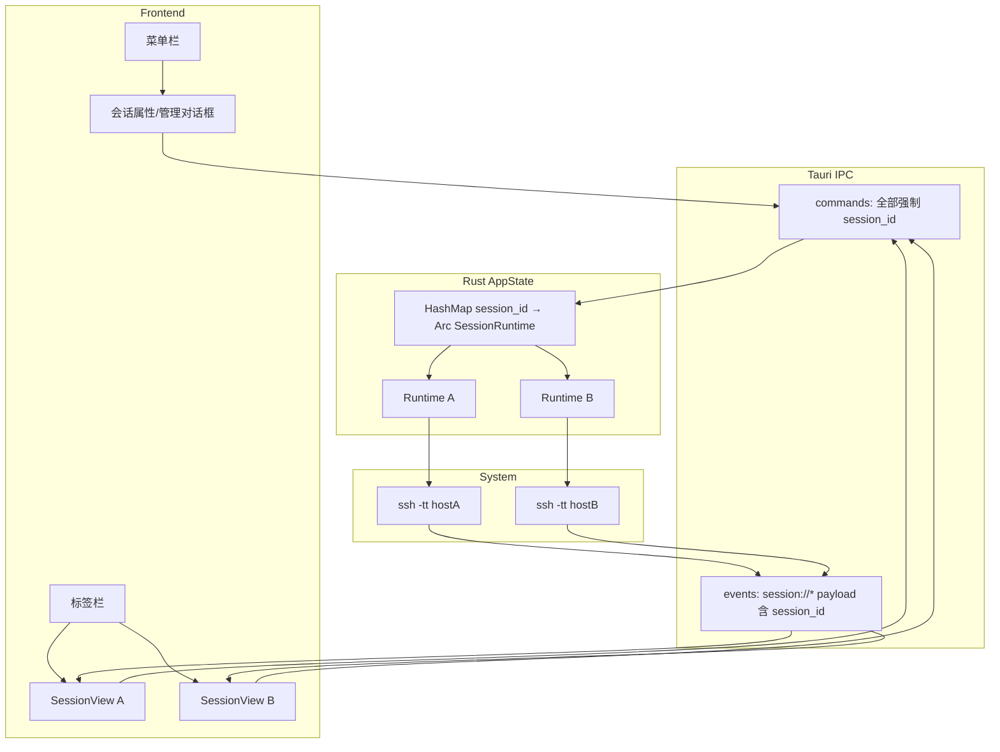
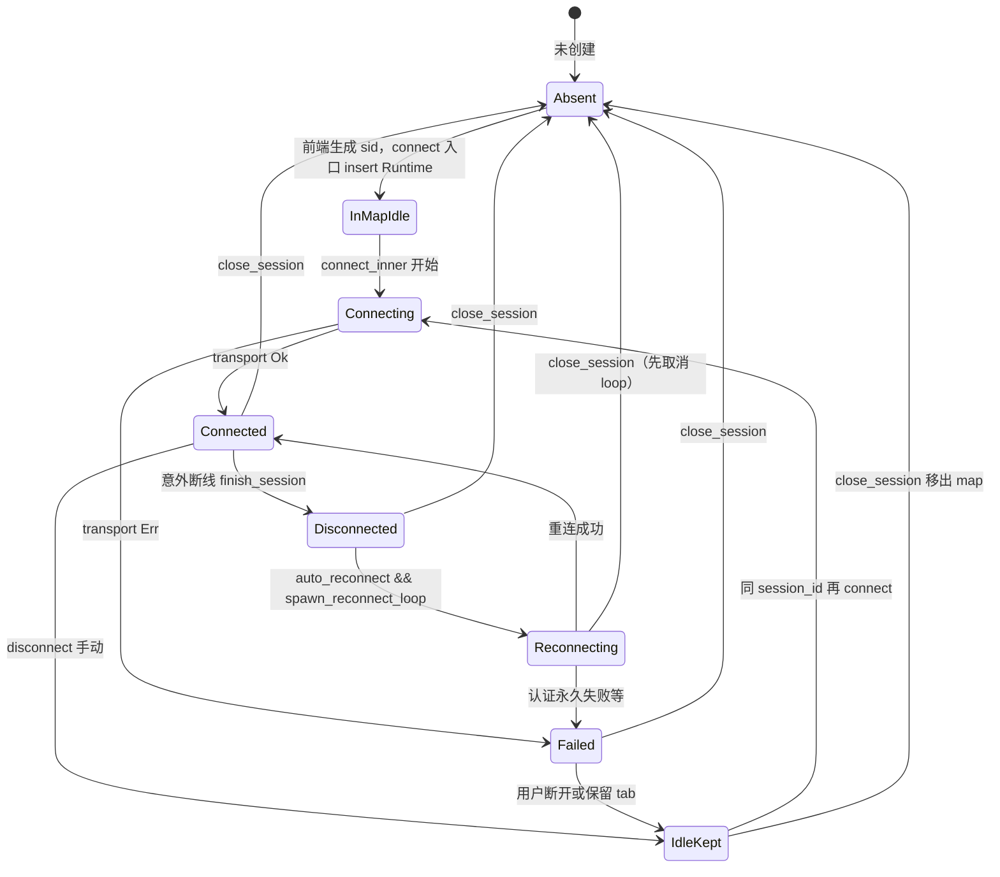
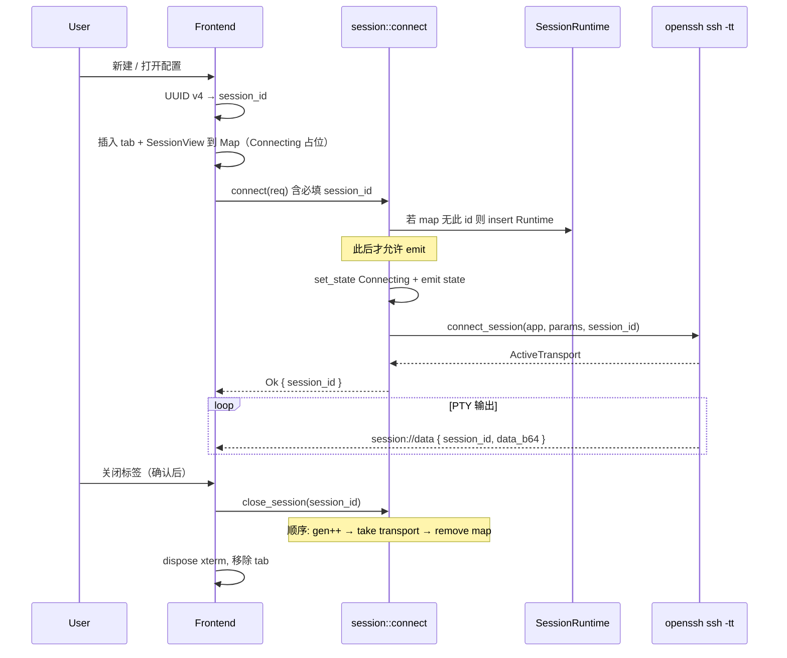
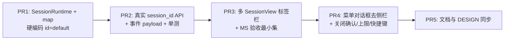
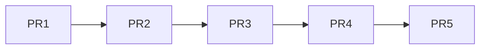

# AnchorTerm 多标签会话与 Xshell 风格界面 — 功能设计文档

| 字段 | 内容 |
|------|------|
| **文档标题** | 多标签多主机会话 + 菜单化连接管理（Xshell 风格 IA） |
| **作者** | （待填） |
| **日期** | 2026-07-25 |
| **状态** | Implemented（PR1–PR5 已交付，见 `docs/reviews/` 与 README 会话沉淀） |
| **相关代码基线** | 以 [README.md 会话沉淀](../README.md) 为准：OpenSSH 交互 PTY、多 `session_id`、菜单/多 tab、cwd 恢复与失败回滚。`DESIGN.md` 阶段表已在 PR5 更新（多标签提前交付）。 |
| **目标读者** | 熟悉 `src-tauri/src/session`、`app_state.rs`、`src/main.ts` 的开发者 |

---

## Overview

当前 AnchorTerm 的主界面左侧常驻连接表单与主机配置列表，主区仅有**单个** xterm 实例；后端 `AppState` 也只持有**一条** `ActiveTransport`（`AlreadyConnected` 拒绝第二条连接）。这与 Xshell / SecureCRT 等成熟 SSH 客户端的信息架构（IA）差距明显：用户无法在同一窗口同时连多台主机，连接属性挤占终端可视区域。

本设计将界面改为 **顶栏菜单 + 标签栏 + 全宽终端区** 的 Xshell 风格布局：连接参数进入**对话框**；保存的主机配置（`HostProfile`）通过**会话菜单 / 会话管理对话框** CRUD 与打开；每个标签页拥有独立的 SSH 会话、xterm、草稿缓冲、cwd 跟踪、输入模式与重连状态。后端从全局单会话演进为 **`session_id → SessionRuntime` 映射**，命令与事件均带 `session_id`，同时严格保留 README 已沉淀能力（OpenSSH `ssh -tt`、mutex 锁顺序、`restore_target`、侧信道补全等）。

**session_id 时序（锁定）**：前端在 `invoke('connect')` **之前**用 UUID v4 生成 `session_id`，插入 tab/`SessionView` 路由表，并作为 `ConnectRequest.session_id` **必填**传给后端；后端在 **任何** `emit(session://*)` 之前将该 id 插入 map。禁止「等 connect 返回后再绑定 id」——否则 Connecting 态与早期 data 事件无处路由。

---

## Background & Motivation

### 基线说明

| 文档 | 状态 | 本设计采用 |
|------|------|------------|
| [README.md 会话沉淀](../README.md) | 人工联调通过的实现真相源 | **主基线** |
| [DESIGN.md](../DESIGN.md) | 阶段表仍写 C/D 待做；多标签在「阶段 3 与 Jump」 | 产品定位仍有效；阶段表 **PR5 更新**（多标签提前交付） |
| [docs/ACCEPTANCE.md](../docs/ACCEPTANCE.md) | 勾选可能为空 | PR2 起追加 MS-\*；PR5 收齐 |

### 当前状态

| 层级 | 现状 | 关键路径 |
|------|------|----------|
| UI 布局 | `grid: 300px 侧栏 + 主区`；侧栏含连接表单 + 配置列表（含 `#profile-name`） | `index.html`, `styles.css` |
| 终端 | 全局一个 `Terminal` / `FitAddon` / 草稿框 | `src/main.ts` |
| 状态 | `AppState { transport, meta, cwd, restore_target, cached, auto_reconnect, reconnect_gen, cwd_freeze, cols, rows }` 单份 | `src-tauri/src/app_state.rs` |
| 会话命令 | `connect` / `disconnect` / `submit_line` / `complete_draft` / `resize` / `write_bytes` 无 session 维度 | `src-tauri/src/session/mod.rs` |
| 事件 | 全局 `session://state`、`session://data`、`session://cwd`（payload 为裸 string 或 snapshot） | `session/mod.rs`, `ssh/openssh.rs` |
| 配置 | `HostProfile` 已支持多条（含 `reconnect_enabled`，**现网未读取**）；`%APPDATA%\AnchorTerm\profiles.json`；密码在 Credential Manager 服务 `AnchorTerm` | `config/profile.rs`, `auth/credentials.rs` |

### 痛点

1. **左侧表单常驻**：主机/端口/用户/认证占用约 300px 宽度，连接后仍占空间，不符合 Xshell「连接属性进对话框、主区全是终端」的习惯。
2. **单会话瓶颈**：`connect_inner` 在 `transport.is_some()` 时返回 `AlreadyConnected`，无法同时运维多台机器。
3. **配置入口与连接入口耦合**：点配置项即 `fillForm`，没有「仅编辑 / 打开到新标签 / 快速连接」的清晰动作。
4. **事件与状态无命名空间**：一旦引入多会话，全局 `session://data` 会把字节写错标签。

### 约束（不可回归）

来自 [README.md 会话沉淀](../README.md)：

- 交互会话必须走系统 OpenSSH `ssh -tt`（非纯 russh PTY）。
- `std::sync::Mutex` 不可重入：更新 `cwd` 后**必须先释放锁**再 `emit` / `snapshot()`。
- `restore_target` 冻结绝对路径；恢复剧本在交互 PTY 上静默 `cd`；**禁止**用侧信道 `pwd` 校验交互 cwd。
- 草稿本地保留；Shell / TUI 双模式；Tab 补全走侧信道 `openssh_exec` + `compgen`。
- 操作日志禁止记录 password / passphrase 明文。

---

## Goals & Non-Goals

### Goals

1. **Xshell 风格信息架构**：顶栏菜单（文件 / 编辑 / 查看 / 会话 / 工具 / 帮助）、标签栏多会话、连接属性对话框（非常驻侧栏表单）。
2. **连接设置移出左侧**：删除当前侧栏连接表单与配置列表；连接/编辑通过菜单与模态对话框完成。
3. **多主机配置 CRUD**：继续使用现有 `HostProfile`；支持新建、编辑（不连接）、删除、打开（连接并建标签）。
4. **多标签同时连接**：一窗口最多 **16** 个标签；每标签独立 host、PTY、xterm、草稿、cwd、重连、Shell/TUI 模式。
5. **阶段 1 能力按会话保留**：每标签各自 cwd 恢复、草稿、Tab 补全、密钥/密码认证。
6. **可增量交付**：后端 session map 与前端 UI 可分 PR 合入，避免大爆炸重写。

### Non-Goals（本阶段不做）

| 项 | 说明 |
|----|------|
| 分屏（split pane） | 同窗口左右/上下多 pane；可列为后续阶段 |
| Jump Host / ProxyJump | 隧道跳板 |
| SFTP / 文件传输 | 独立面板 |
| 会话文件夹树 / 颜色标签 / 快捷方式栏 | 本阶段仅「会话管理对话框」列表；完整会话树延后 |
| 多窗口（multi-window） | 仅单主窗口多 tab |
| 跨标签共享剪贴板历史 / 宏 | — |
| 本地 shell 标签 | 仅远程 SSH |
| 改变 OpenSSH 交互路径 | 仍用 `ssh -tt` |
| 自动重跑 TUI（vim/top 状态恢复） | 仍属阶段 2 |
| **尊重 `HostProfile.reconnect_enabled`** | 字段保留在 schema，**本阶段继续忽略**；重连策略仅「手动断开 → 不自动重连 / 意外断线 → 自动重连」。避免实现者「顺手接上」与阶段 1 行为漂移 |
| 「复制会话」菜单项 | 用「再次打开同一 profile」代替 |

---

## Proposed Design

### 1. 目标信息架构（对标 Xshell）

```
┌──────────────────────────────────────────────────────────────────────────┐
│ 文件(F)  编辑(E)  查看(V)  会话(S)  工具(T)  帮助(H)     [状态·cwd·主机] │  ← 菜单 + 状态栏
├──────────────────────────────────────────────────────────────────────────┤
│ [生产机 ●] [测试机 ○] [临时连接 …]                              [+] [×] │  ← 标签栏
├──────────────────────────────────────────────────────────────────────────┤
│                                                                          │
│                         xterm.js（当前激活标签的终端）                      │
│                                                                          │
├──────────────────────────────────────────────────────────────────────────┤
│ 草稿: [________________________] [发送] [Shell 模式]                      │  ← 每标签独立草稿
└──────────────────────────────────────────────────────────────────────────┘
```

**与 Xshell 的对应关系**

| Xshell 习惯 | AnchorTerm 本设计 |
|-------------|-------------------|
| 文件 → 新建 / 打开 / 退出 | 文件菜单：新建会话、打开会话管理、退出 |
| 会话属性对话框 | `SessionPropertiesDialog`（显示名称 + 主机/端口/用户/认证） |
| 会话管理器列表 | `SessionManagerDialog`：列表 + 新建/编辑/删除/打开 |
| 标签页多会话 | `TabBar` + 每 tab 一个 `SessionView` |
| 连接后主区全终端 | 去掉 300px 连接侧栏 |
| 标签关闭 | Connected/Reconnecting 时确认后 `close_session` |

#### 1.1 菜单信息架构表（可实现规格）

本阶段使用 **HTML menubar**（非 Tauri 原生 Menu）。灰色项 = 本阶段不做（菜单可省略或 disabled + title「后续版本」）。

| 菜单 | 菜单项 | 行为 | 快捷键 |
|------|--------|------|--------|
| **文件** | 新建会话… | 打开属性对话框 mode=`create` | Ctrl+N |
| | 打开会话管理器… | 打开 `SessionManagerDialog` | Ctrl+O |
| | 退出 | `getCurrentWindow().close()` 或 `exit(0)`（Tauri window API）；若存在 Connected tab，先逐个或汇总确认 | Alt+F4（系统） |
| **编辑** | 复制 | 当前 active xterm 选区 → clipboard（`term.getSelection()` + `navigator.clipboard`） | Ctrl+Shift+C |
| | 粘贴 | clipboard → 若 Shell 模式写入草稿光标处；若 TUI 则 `write_bytes` 到 PTY | Ctrl+Shift+V |
| | 清草稿 | 清空 active tab 草稿框 | — |
| | ~~查找~~ | 灰：不做 | — |
| **查看** | 切换输入模式 | Shell ↔ TUI（等同现按钮） | Ctrl+Shift+M |
| | 清屏 | active xterm `term.clear()`（仅本地 buffer，不发 remote clear） | Ctrl+L 仅 TUI 时仍走 PTY；菜单清屏=本地 |
| | ~~字体大小 +/-~~ | 灰：不做 | — |
| **会话** | 新建会话… | 同文件→新建 | Ctrl+N |
| | 打开… | 同会话管理器 | Ctrl+O |
| | 断开 | `disconnect(activeSessionId)`；无 active 则 noop | — |
| | 重新连接 | 对 **Idle/Failed/Disconnected** 的 active tab 打开属性对话框 mode=`reconnect`（预填 cached/上次参数）并连接；已 Connected 则 disabled | — |
| | 关闭标签 | 同点 ×（含确认规则） | Ctrl+W |
| | 会话属性… | 打开属性对话框 mode=`edit-runtime` 或对 profile `edit`（见 §6.9） | — |
| **工具** | 打开操作日志目录 | 用 shell/opener 打开 `操作日志\` 路径（现有 `tauri-plugin-opener`） | — |
| | ~~密钥管理~~ | 灰：不做 | — |
| **帮助** | 关于 AnchorTerm | 简单 dialog：名称 + 版本（`package.json` / tauri conf） | — |
| | Shell Integration 说明 | 打开或展示 `docs/shell-integration` 要点（可外链/内嵌短文） | — |

### 2. 前端结构

#### 2.1 DOM 骨架（`index.html`）

移除 `#sidebar` 中的连接表单与配置列表常驻区，改为：

```html
<div id="app">
  <header class="titlebar">
    <nav class="menubar" id="menubar" role="menubar">…</nav>
    <div class="status" id="status-bar">… 绑定「当前激活会话」…</div>
  </header>

  <div class="tab-bar" id="tab-bar" role="tablist">
    <!-- 动态: .tab[data-session-id] role="tab" -->
    <button type="button" id="btn-new-tab" title="新建会话">+</button>
  </div>

  <main class="workspace">
    <div id="session-views">
      <!-- 每个会话一个 .session-view[data-session-id] -->
      <!-- 内含: #term-{id}, 草稿条, overlay, 可选 error -->
    </div>
    <div id="empty-state" class="empty-state">
      <p>尚未打开会话</p>
      <button type="button" data-action="new-session">新建会话</button>
      <button type="button" data-action="open-manager">打开已保存会话</button>
    </div>
  </main>
</div>

<dialog id="dlg-session-props" aria-labelledby="dlg-props-title">…</dialog>
<dialog id="dlg-session-manager" aria-labelledby="dlg-mgr-title">…</dialog>
<dialog id="dlg-confirm" aria-labelledby="dlg-confirm-title">…</dialog>
<dialog id="dlg-about">…</dialog>
```

**字段迁移**（全部进入 `#dlg-session-props`）：

| 原侧栏 id | 对话框字段 |
|-----------|------------|
| `#profile-name` | 显示名称（保存配置时必填逻辑见按钮矩阵；连接时可用 `user@host` 兜底） |
| `#host` `#port` `#username` | 同现网 |
| `#auth-type` `#password` `#save-password` | 同现网 |
| `#private-key-path` `#passphrase` | 同现网 |

会话管理器列表负责「选中 / 打开 / 编辑 / 删除」；**不再**在主界面常驻 profile 列表。

#### 2.2 前端模块划分（建议拆分 `main.ts`）

| 模块 | 职责 |
|------|------|
| `src/app/types.ts` | `HostProfile`, `SessionSnapshot`, `TabModel` 等类型 |
| `src/app/menu.ts` | 菜单栏渲染、快捷键、打开对话框 |
| `src/app/dialogs/session-props.ts` | 连接属性对话框：模式 × 按钮 |
| `src/app/dialogs/session-manager.ts` | 会话列表、双击打开、编辑、删除 |
| `src/app/tabs/tab-bar.ts` | 标签创建/切换/关闭/标题与状态点 |
| `src/app/session/session-view.ts` | 单会话：xterm、FitAddon、草稿、补全、overlay、inputMode |
| `src/app/session/session-manager.ts`（前端） | `Map<sessionId, SessionView>`、激活 tab、事件路由、未知 sid 策略 |
| `src/app/ipc.ts` | 封装 `invoke`，所有会话命令带 `sessionId` |
| `src/main.ts` | 启动：挂菜单、全局 listen、空状态 |

**核心前端模型**

```typescript
interface TabModel {
  sessionId: string;          // 前端生成 UUID v4，与后端 map key 一致
  profileId?: string | null;
  title: string;              // 纯前端 UI 状态（见 §2.2.1）
  state: SessionStateName;
  host?: string;
  username?: string;
  cwd?: string | null;
}

class SessionView {
  sessionId: string;
  term: Terminal;
  fitAddon: FitAddon;
  draft: PendingInputBuffer;
  inputMode: "shell" | "raw";
  pendingDraft: string | null;
  completeUi: CompleteUiState | null;
  rootEl: HTMLElement;
  // mount/unmount, onData, onState, onCwd, activate, dispose
}
```

##### 2.2.1 标签标题数据源（锁定）

- **`TabModel.title` 是纯前端状态**；后端 `SessionSnapshot` **不包含** `title` 字段。
- 赋值规则：
  1. 从 HostProfile 打开 → 初始 `title = profile.name`。
  2. 快速连接（无 profile）→ `title = `${username}@${host}``。
  3. **同一 `profile.name`（或同一 user@host）已有打开 tab** → 追加序号：`生产机`、`生产机 (2)`、`生产机 (3)`…（按当前已打开 tab 扫描，不是磁盘计数）。
  4. cwd 变化 **不**自动改标题（避免标签抖动）；可选后续增强。
- connect 可选在 ops_log 打 `title=` 仅用于诊断，不进 snapshot。

##### 2.2.2 激活 / 可见性 / fit / resize（锁定）

- 非激活 `SessionView`：CSS `display: none`，**不销毁** xterm（后台仍 `term.write`）。
- **`activate(sessionId)` 必选路径**（顺序固定）：
  1. 旧 active 去 `.active`；
  2. 新 view 加 `.active`（`display: flex`）；
  3. **下一帧** `requestAnimationFrame` → `fitAddon.fit()`（`display:none` 时尺寸为 0，**必须**在变为可见后 fit）；
  4. `invoke('resize', { sessionId, cols, rows })` 推远端 stty；
  5. 更新状态栏；Shell 模式聚焦草稿，TUI 聚焦 term。
- **窗口 `resize` / ResizeObserver**：
  - 仅对 **active** view：`fit` + debounce 后 `resize(sessionId)`；
  - 非 active：**不**调用 fit/stty（避免 0 尺寸）；切换 activate 时再 fit。
- **软上限**：**最多 16 个 tab**；再开时 toast「最多打开 16 个会话」并拒绝创建（不调用 connect）。

##### 2.2.3 未知 `session_id` 事件策略

前端全局 listen 后查 `Map`：

| 情况 | 策略 |
|------|------|
| 已知 `session_id` | 路由到对应 `SessionView` |
| 未知 `session_id` | **丢弃** payload；`opsLog('ERR', 'event_route_miss', { sid, event })`；不创建幽灵 tab |
| 竞态防护 | 因客户端先插 Map 再 connect，正常路径不应 miss；若 miss 视为 bug |

#### 2.3 CSS（`styles.css`）

```css
#app {
  display: grid;
  grid-template-rows: 36px 32px 1fr; /* menubar | tabbar | workspace */
  grid-template-columns: 1fr;        /* 取消 300px 侧栏 */
  height: 100vh;
}
.workspace { position: relative; min-height: 0; }
.session-view {
  display: none;
  flex-direction: column;
  height: 100%;
}
.session-view.active { display: flex; }
.tab-bar { display: flex; gap: 2px; overflow-x: auto; }
/* 菜单、dialog、empty-state、焦点环 */
```

#### 2.4 对话框通用交互（最小 a11y）

- 使用原生 `<dialog>`：`showModal()` / `close()`。
- **Esc** → 关闭（连接进行中：属性对话框 **不**因 Esc 取消后端 connect，仅关闭 UI；后端连接继续，结果仍路由到已建 tab）。
- **焦点陷阱**：`showModal()` 自带；打开时 focus 第一个输入框；关闭后焦点回到触发控件或 active 草稿。
- **连接中**：属性对话框「连接 / 保存并连接」按钮 `disabled`，防止重复 submit。
- 确认框、关于框同样 `showModal`。

### 3. 后端架构：单会话 → 多会话

#### 3.1 概念区分（重要）

| 概念 | 含义 | ID |
|------|------|-----|
| **HostProfile** | 持久化连接配置（可多条） | `profile.id`（UUID，已有） |
| **SessionRuntime** | 一次运行中的连接实例（一个 tab） | `session_id`（UUID v4，**前端生成**，后端认可后插入 map） |

同一 `HostProfile` 可打开**多个** tab（两次「打开」= 两个 `session_id`，两个独立 PTY）。

#### 3.2 目标数据结构

```rust
// app_state.rs（演进后）

pub struct SessionRuntime {
    pub id: String,
    pub transport: Mutex<Option<ActiveTransport>>,
    pub meta: Mutex<SessionMeta>,
    pub cwd: Mutex<CwdTracker>,
    pub restore_target: Mutex<Option<String>>,
    pub cached: Mutex<Option<CachedConnect>>,
    pub auto_reconnect: AtomicBool,
    pub reconnect_gen: AtomicU64,
    pub cwd_freeze: AtomicBool,
    pub cols: AtomicU32,
    pub rows: AtomicU32,
    /// per-session stty debounce（替代进程级 static LAST_STTY）
    pub last_stty: Mutex<Option<std::time::Instant>>,
}

/// 进程级状态：仅会话表。
/// **禁止**存储 UI 焦点 / current_session_id（后端无焦点概念）。
pub struct AppState {
    pub sessions: Mutex<HashMap<String, Arc<SessionRuntime>>>,
}

/// PR1 only: 临时常量，PR2 删除
pub const DEFAULT_SESSION_ID: &str = "default";
```

**锁顺序（扩展现有约定）**

1. 先取 `sessions` 锁 → 克隆 `Arc<SessionRuntime>` → **立即释放** `sessions` 锁。
2. 对单个 `SessionRuntime`：与今日相同 — **禁止**持有 `cwd`/`meta` 调用 `snapshot()`；先更新再 emit。
3. 禁止在持有 `SessionRuntime` 内锁时再去抢 `sessions` 写锁。

`SessionSnapshot`（**无 title**）：

```rust
pub struct SessionSnapshot {
    pub session_id: String,
    pub state: SessionState,
    pub host: Option<String>,
    pub username: Option<String>,
    pub message: Option<String>,
    pub cwd: Option<String>,
    pub attempt: Option<u32>,
    pub profile_id: Option<String>,
}
```

#### 3.3 架构图



#### 3.4 Runtime 生命周期状态机（锁定）



| 阶段 | map 中？ | transport | tab 前端 | 说明 |
|------|----------|-----------|----------|------|
| **connect 入口** | insert | None→建立中 | 已有（前端先建） | 任何 emit **之前**必须已 insert |
| **Connected** | 是 | Some | 是 | |
| **disconnect（手动）** | **保留** | None | **保留** | `auto_reconnect=false`，冻结 restore_target，state=Idle |
| **意外断线** | 保留 | None | 保留 | 可能 Reconnecting |
| **同 tab 再连接** | 同一 sid | 重建 | 同一 tab | 复用 **同一 `session_id`**；同 host+user 则 restore_target 恢复 cwd |
| **close_session** | **移除** | take+Disconnect | dispose | 见下方取消顺序 |

##### 3.4.1 `close_session` 取消与移除顺序（必须按序）

```text
1. 取 Arc<SessionRuntime>（sessions 读锁 → clone Arc → 释放）
2. auto_reconnect.store(false)
3. reconnect_gen.fetch_add(1)          // 取消 reconnect_loop / 使旧 gen 退出
4. cwd_freeze.store(false)             // 避免遗留冻结
5. transport.take() + send Disconnect  // Drop ActiveTransport → SecureKeyMaterial 删临时 key
6. （可选）等待 stdout wait 任务结束的短超时；不必死等
7. sessions 写锁：remove(session_id)   // 最后移除；之后事件若仍发出，前端 route_miss
8. 前端 dispose xterm / 删 tab
```

后台任务必须遵守：

| 任务 | 取消条件 |
|------|----------|
| `reconnect_loop(gen)` | `reconnect_gen != gen` 或 map 中无此 sid 或 `!auto_reconnect` |
| `run_restore_playbook` | 每步检查 state==Connected 且 transport 仍属该 runtime |
| `schedule_seed_login_pwd` | spawn 时捕获 `Arc<SessionRuntime>` 或 `session_id`；执行前 `sessions.get` 失败则 return |
| stdout pump / wait → `finish_session` | 闭包捕获 `session_id` 或 `Arc`；**禁止**无 id 的全局 `try_state` 单例路径 |

**`session_id` 永不复用**：每次新建 tab 新 UUID；close 后 id 作废。避免「已 close 又新建同 id」误伤（UUID 碰撞可忽略）。

##### 3.4.2 会话生命周期时序（修正后）



### 4. 命令与事件 API

#### 4.1 命令变更原则

- **会话作用域命令一律强制 `session_id`**；后端 **无** `current_session` / UI 焦点默认。
- **配置命令**保持全局：`list_profiles` / `save_profile` / `delete_profile`。
- **`ConnectRequest.session_id: String` 必填**（前端生成）。若 map 中已有该 id 且 `transport.is_some()` → `SessionAlreadyConnected`；若有 id 无 transport（disconnect 后再连）→ **复用**该 Runtime 走 connect_inner。
- 全新 tab：map 中无此 id → insert 新 `SessionRuntime { id: session_id, … }`。

**签名（Rust）**

```rust
pub struct ConnectRequest {
    pub session_id: String,       // 必填，客户端 UUID
    pub host: String,
    pub port: u16,
    pub username: String,
    pub auth: AuthMethod,
    pub cols: u32,
    pub rows: u32,
    pub profile_id: Option<String>,
}

pub struct ConnectResponse {
    pub session_id: String,       // 回显同一 id
}

#[tauri::command]
pub async fn connect(app: AppHandle, state: State<'_, AppState>, mut req: ConnectRequest)
  -> Result<ConnectResponse, String>;

#[tauri::command]
pub async fn disconnect(state: State<'_, AppState>, app: AppHandle, session_id: String)
  -> Result<(), String>;
// 保留 Runtime 在 map；tab 不关

#[tauri::command]
pub async fn close_session(state: State<'_, AppState>, app: AppHandle, session_id: String)
  -> Result<(), String>;
// §3.4.1 顺序；关 tab 用此命令

#[tauri::command]
pub async fn submit_line(state: State<'_, AppState>, app: AppHandle,
    session_id: String, line: String) -> Result<(), String>;

#[tauri::command]
pub async fn write_bytes(state: State<'_, AppState>,
    session_id: String, data_b64: String) -> Result<(), String>;

#[tauri::command]
pub async fn complete_draft(state: State<'_, AppState>,
    session_id: String, line: String, cursor: usize)
  -> Result<CompleteResult, String>;

#[tauri::command]
pub async fn resize(state: State<'_, AppState>,
    session_id: String, cols: u32, rows: u32) -> Result<(), String>;

#[tauri::command]
pub async fn get_session_snapshot(state: State<'_, AppState>, session_id: String)
  -> Result<SessionSnapshot, String>;

#[tauri::command]
pub async fn list_sessions(state: State<'_, AppState>)
  -> Result<Vec<SessionSnapshot>, String>;
```

**错误语义**

| 错误 | 何时 |
|------|------|
| `SessionAlreadyConnected` | 该 `session_id` 已有 transport（替代全局 `AlreadyConnected`） |
| `NotConnected` | 该 sid 无 transport |
| `SessionNotFound` | map 中无此 sid（命令） |

#### 4.2 事件命名空间

**事件名不变，payload 一律带 `session_id`。PR2 前后端必须同提交——无长期兼容层；dev hot reload 半新半旧会导致前端把对象当 base64 解码失败，属预期，升级时不可只升后端。**

```typescript
interface DataEvent { session_id: string; data_b64: string }
interface StateEvent { /* SessionSnapshot 字段，含 session_id */ }
interface CwdEvent { session_id: string; cwd: string }
interface ErrorEvent { session_id: string; message: string } // 可选
```

| 事件 | 旧 payload | 新 payload |
|------|------------|------------|
| `session://state` | `SessionSnapshot`（无 id） | `SessionSnapshot` + 必填 `session_id` |
| `session://data` | `string` (b64) | `{ session_id, data_b64 }` |
| `session://cwd` | `string` | `{ session_id, cwd }` |
| `session://error` | 若现网有 listen：裸 string | `{ session_id, message }`；若未使用可仍 emit 同形以便统一路由 |

前端路由 miss → `opsLog('ERR', 'event_route_miss', { sid, event })`。

#### 4.3 `openssh` / transport 改造点与函数迁移清单

**契约**：

```rust
// transport / openssh
pub async fn connect_session(
    app: AppHandle,
    params: ConnectParams,
    session_id: String,           // 或 Arc<SessionRuntime>
) -> Result<ActiveTransport, AppError>;

// 内部 connect_openssh(app, params, session_id, …)
// stdout pump / wait 闭包捕获 session_id（或 Arc），调用：
//   on_data(app, &session_id, data)
//   finish_session(app, &session_id, manual)
```

**禁止**：`on_data` / `finish_session` / seed / reconnect 仅 `app.try_state::<AppState>()` 后操作「全局唯一字段」而不带 session 维度（PR1 的 `"default"` shim 除外，且 PR2 删除）。

##### 4.3.1 必须改为 `&SessionRuntime` 或带 `session_id` 的函数清单（PR1/PR2 review 勾选）

| 符号 | 文件 | 改造要点 |
|------|------|----------|
| `AppState` 字段整体 | `app_state.rs` | 迁入 `SessionRuntime`；`AppState` 仅 map |
| `AppState::snapshot` | `app_state.rs` | → `SessionRuntime::snapshot` |
| `emit_state` / `set_state` | `session/mod.rs` | 参数 `&SessionRuntime`，payload 含 id |
| `connect` / `connect_inner` | `session/mod.rs` | 按 `req.session_id` insert/get；再连复用 |
| `resolve_password` | `session/mod.rs` | 可保持纯函数 |
| `session_still_connected` | `session/mod.rs` | `&SessionRuntime` |
| `send_pty_bytes` | `session/mod.rs` | `&SessionRuntime` |
| `run_restore_playbook` | `session/mod.rs` | `&SessionRuntime` |
| `connect_params_from_cache` | `session/mod.rs` | `&SessionRuntime` |
| `query_remote_pwd` | `session/mod.rs` | `&SessionRuntime` |
| `query_dir_exists` | `session/mod.rs` | `&SessionRuntime` |
| `schedule_seed_login_pwd` | `session/mod.rs` | 捕获 `session_id`/`Arc`；禁止全局 cwd |
| `spawn_reconnect_loop` / `reconnect_loop` | `session/mod.rs` | 按 `session_id` + 该 runtime 的 gen |
| `disconnect` / `disconnect_inner` | `session/mod.rs` | 按 sid；**不** remove map |
| `freeze_restore_target_from_cwd` | `session/mod.rs` | `&SessionRuntime` |
| `close_session` | `session/mod.rs` | 新命令；§3.4.1 顺序 |
| `write_bytes` / `write_inner` | `session/mod.rs` | 按 sid 更新该 cwd/restore + write |
| `submit_line` / `submit_line_inner` | `session/mod.rs` | 同上 |
| `complete_draft` / `complete_draft_inner` | `session/mod.rs` | 按 sid 的 cached + cwd |
| `resize` / `resize_inner` | `session/mod.rs` | per-runtime `last_stty`，删 `static LAST_STTY` |
| `get_session_snapshot` | `session/mod.rs` | 强制 sid 参数 |
| `list_sessions` | `session/mod.rs` | 新 |
| `connect_session` | `ssh/transport.rs` | 增加 `session_id` 传入 openssh |
| `connect_openssh` | `ssh/openssh.rs` | 签名含 `session_id` |
| `on_data` | `ssh/openssh.rs` | `(app, session_id, data)` |
| `finish_session` | `ssh/openssh.rs` | `(app, session_id, manual)`；reconnect 按该 sid |
| stdout wait 任务 | `ssh/openssh.rs` | 调用 `finish_session` 时带 sid（现约无 session 维度处） |
| `SecureKeyMaterial` / Drop | `ssh/openssh.rs` | 保持 per-transport；close 时 take transport 触发 Drop |

**临时密钥文件**：每会话独立 `SecureKeyMaterial`；`close_session` 必须 `transport.take()` 后再 `remove` map，确保 Drop 删除临时 key。

### 5. HostProfile / 会话管理（配置层）

配置层**基本保持**，已满足「保存多条」：

- 存储：`%APPDATA%\AnchorTerm\profiles.json`
- 密码：Windows Credential Manager，服务名 `AnchorTerm`，key = profile id
- API：`list_profiles` / `save_profile` / `delete_profile` 不变
- **`reconnect_enabled`：本阶段忽略**（见 Non-Goals）

**UI 行为**

| 操作 | 行为 |
|------|------|
| 新建会话 | 属性对话框 mode=`create` |
| 会话管理器 | 列表全部 profile；双击 /「打开」→ 新 tab + connect（新 sid） |
| 编辑 | mode=`edit-profile`；保存不连接、不改已开 tab |
| 删除 | 确认后 `delete_profile`；**不**关闭已打开 tab（cached 凭据仍可用至 close） |
| 快速连接 | mode=`create` 只点「连接」不保存 → `profile_id = null` |

**`profile.name` 归属**：字段在 **属性对话框**（原 `#profile-name`）；会话管理器列表展示 name + `user@host:port` 元数据。管理器本身不单独提供「仅改名」表单。

可选后续字段（非必须）：`last_connected_at`、`folder`、`color` — **本阶段不改 schema**。

### 6. UX 流程

#### 6.1 新建并连接

1. **会话 → 新建会话** / 标签栏 `+` / Ctrl+N / empty-state。
2. 打开 `SessionPropertiesDialog` mode=`create`。
3. 用户填写显示名称（可选）、主机信息、认证。
4. 点「连接」或「保存并连接」（见 §6.9）：
   - 前端：`session_id = crypto.randomUUID()`（或等价 UUID v4）；
   - 插入 tab + `SessionView`（state=connecting，title 按 §2.2.1）；
   - `invoke('connect', { req: { session_id, … } })`；
   - 若 tab 数已 ≥16：toast 并中止。
5. 成功：状态点绿、overlay 隐藏、焦点草稿。
6. 失败：tab 保留 Failed；对话框默认保持打开并显示错误（可改参数重试：此时应用 **同一 session_id** 再 connect，或用户关 tab 后重来）。

#### 6.2 打开已保存配置

1. **会话 → 打开** / Ctrl+O。
2. 选中 profile → **打开** 或双击 → **始终新 tab** + 新 `session_id`。
3. `profile_id` 传入；密码空则 keyring；title=`profile.name`（含多开序号）。

#### 6.3 编辑配置（不连接）

1. 会话管理器 → 编辑。
2. mode=`edit-profile` → 仅「保存」「取消」。
3. 已打开 tab **不**自动重连/改 host。

#### 6.4 切换标签

- 点击 tab → `activate(sessionId)`（§2.2.2 全路径）。
- 快捷键：Ctrl+Tab / Ctrl+Shift+Tab（建议 PR4 实现）；Ctrl+W 关闭当前。

#### 6.5 断开 vs 关闭标签

| 动作 | 行为 |
|------|------|
| **会话 → 断开** | `disconnect(session_id)`：停自动重连、冻结 restore_target、take transport；**Runtime 与 tab 均保留**；草稿与 xterm buffer 保留 |
| **关闭标签 (×) / Ctrl+W** | 若 state ∈ {connected, reconnecting, connecting}：**确认**「关闭将断开连接且无法恢复本页终端缓冲」→ 是则 `close_session` + dispose；Idle/Failed/Disconnected：**直接** close |
| **意外断线** | 仅该 tab Reconnecting；其他 tab 不变 |
| **同 tab 再连接** | **复用同一 `session_id`**；Idle 且无 transport；同 host+user → restore_target 恢复 cwd；不同 endpoint → 清空 restore（与现网一致） |

#### 6.6 重连

- 每 Runtime 独立 `auto_reconnect` / `reconnect_gen` / backoff。
- 手动 disconnect 的 tab 不自动重连。
- **不**读取 `HostProfile.reconnect_enabled`。

#### 6.7 错误展示

- Active：状态栏 message + per-view 错误区。
- 后台 tab：标签警告色状态点。
- 对话框校验错误留在对话框内。

#### 6.8 空状态

无 tab 时显示 empty-state：「新建会话」「打开已保存会话」。**PR4 必交付。**

#### 6.9 属性对话框：模式 × 按钮矩阵

| 模式 | 入口 | 显示名称 | 主按钮 | 次按钮 | 取消 | 失败后 |
|------|------|----------|--------|--------|------|--------|
| `create` | 新建会话 / + | 可空（连接时 title 用 user@host；保存时若空则默认 `user@host`） | **连接** | **保存并连接**（先 save_profile 再 connect） | 关闭 dialog，不建 tab | dialog **保持打开**，tab 若已建则为 Failed |
| `create` 仅保存 | 同上 | 保存需要 name 或默认 | **保存**（不 connect、不建 tab） | — | 关闭 | dialog 保持，显示错误 |
| `edit-profile` | 管理器→编辑 | 必填逻辑同 save | **保存** | — | 关闭 | 保持打开 |
| `open-from-manager` | 不经属性框，管理器直接 open | — | — | — | — | — |
| `reconnect` | 会话→重新连接 / 断线 tab 再连 | 预填上次 host 等；可改 | **连接**（同一 session_id） | 可选「保存到配置」若有 profile_id | 关闭 | 保持打开 |
| `edit-runtime` | 会话属性（已有 tab） | 可改展示用；改 host 后需断开再连才生效——本阶段：**已 Connected 时字段只读**，仅 Idle 可改后连接 | **连接**（Idle 时） | — | 关闭 | 保持打开 |

「保存」写入 `HostProfile`（含 `name`、host、auth 元数据、可选密码到 keyring），与现 `save_profile` 一致。

#### 6.10 退出应用

- **文件 → 退出**：若存在任一 tab state ∈ {connected, reconnecting, connecting}，确认「有 N 个会话仍连接，退出将全部断开」→ 是则对所有 sid `close_session`（或批量）再 `window.close()`。
- 无活动连接：直接关闭。

### 7. 迁移路径（单会话 → 多会话）



**关键迁移技巧**

1. **PR1 收窄（方案 A，锁定）**：结构上 `SessionRuntime` + `HashMap`，但 **仅允许** `session_id == "default"`；`connect` 内部写死该 id；openssh 闭包捕获 `"default"`；**TS 命令签名不变**；若 map 将出现第二 id → debug_assert / 返回错误。禁止半吊子多会话。
2. **PR2 删除 `DEFAULT_SESSION_ID` shim**；所有命令强制 sid；事件改 payload；前端单 tab 但先生成 UUID。
3. 读泵绑定 session_id；日志 `sid=`。
4. 布局最后换（PR4）。
5. 恢复剧本 / 锁顺序：逐函数 `&SessionRuntime`；对照 §4.3.1 勾选表。

**阶段 1 保证映射**

| 保证 | 多会话下的归属 |
|------|----------------|
| cwd 静默恢复 | per `SessionRuntime.restore_target` |
| 草稿不丢 | per `SessionView.draft` |
| 手动断开不自动重连 | per `auto_reconnect` |
| 同 host+user 再连恢复 | 同 **session_id** 复用 Runtime + restore_target |
| Tab 补全 | `complete_draft(session_id, …)` |
| Mutex 不重入 | per runtime + 锁顺序 |

### 8. 风险与缓解

| 风险 | 严重度 | 缓解 |
|------|--------|------|
| connect 时序导致事件无法路由 | 高 | 客户端必填 sid，先插 Map 再 invoke；后端先 insert 再 emit |
| close × reconnect 竞态 | 高 | §3.4.1 顺序；gen bump；任务检查 map |
| 事件写错 tab / 串流 | 高 | payload `session_id`；route 表；MS 验收 |
| 死锁回归 | 高 | 先释放 cwd 再 snapshot；禁止 sessions 嵌套 |
| 多 ssh.exe 资源 | 中 | 软上限 16；close 必 kill 子进程 |
| resize debounce 串扰 | 中 | per-session `last_stty` |
| 临时 key 残留 | 中 | close 时 take transport 触发 Drop；验收 MS-KEY |
| 半新半旧 payload | 中 | PR2 前后端同提交；开发说明 |
| 多 xterm 内存 | 中 | 隐藏不销毁；上限 16 |

---

## API / Interface Changes

### 前端 invoke 对照

| 旧 | 新 |
|----|-----|
| `connect({ req })` → `()` | `connect({ req })` → `{ session_id }`；**req.session_id 必填** |
| `disconnect()` | `disconnect({ sessionId })` — 保留 Runtime |
| `submit_line({ line })` | `submit_line({ sessionId, line })` |
| `write_bytes({ dataB64 })` | `write_bytes({ sessionId, dataB64 })` |
| `complete_draft({ line, cursor })` | `complete_draft({ sessionId, line, cursor })` |
| `resize({ cols, rows })` | `resize({ sessionId, cols, rows })` |
| `get_session_snapshot()` | `get_session_snapshot({ sessionId })` — **无无参重载** |
| — | `close_session({ sessionId })` — 移除 Runtime |
| — | `list_sessions()` |
| `list/save/delete_profile` | 不变 |

### 事件对照

见 §4.2。PR2 checklist：三事件 + `session://error` 一并改；**不可只升后端**。

---

## Data Model Changes

### 持久化

- **`profiles.json` / `HostProfile`**：无强制字段变更；`reconnect_enabled` 保留但忽略。
- **凭据**：仍按 `profile.id`。

### 运行时（内存）

- `session_id`：前端 UUID → connect insert → close_session remove。
- `CachedConnect` per-session。
- 后端 **无** current/focus session 字段。

### 迁移

- 无磁盘迁移。旧用户升级：empty-state + 已有 profiles 在管理器可见。

---

## Alternatives Considered

### 方案 A：多 WebviewWindow

否决：与一窗口多 tab 主路径不符，窗口管理成本高。

### 方案 B：保留左侧会话树 + 侧栏表单

否决作为主 IA（不满足「左侧不要连接设置」）。

### 方案 C：前端假多 tab、后端单 transport

否决：无法真多主机。

### 方案 D（采用）：单 Webview + 多 SessionRuntime + 菜单/对话框 + 标签栏

采用。

### 方案 E：动态事件名 `session://{id}/data`

否决：固定名 + payload 路由。

### 方案 F：服务端分配 session_id / 两阶段 create_session

**不采用作为主路径**。两阶段也可消除竞态，但多一次 IPC；客户端 UUID 一次 round-trip 即可，且 tab 可在 invoke 前渲染。若未来需要「仅占位未连接的服务端资源」再引入 `create_session`。

---

## Security & Privacy Considerations

| 主题 | 设计 |
|------|------|
| 密码存储 | 仅 Credential Manager；profiles.json 无密码 |
| 内存凭据 | per-session `CachedConnect`；close 时随 Runtime drop |
| 日志 | 禁 password/passphrase；`sid=` 前 8 位 |
| 临时私钥 | per-session `SecureKeyMaterial`；**close_session 必须 take transport 再 remove map**，保证 Drop |
| 攻击面 | 仍仅出站 SSH |

**验收 MS-KEY**：使用公钥登录建立 tab → `close_session` → 确认临时 key 文件已删除（对照 openssh 临时路径策略 / ops_log 中非敏感的 cleanup 记录；**禁止**在日志打印 key 内容）。

---

## Observability

| 手段 | 多会话增强 |
|------|------------|
| `操作日志\` | `sid=` 前 8 位；启动清空 `*.log` |
| 路由 miss | 前端 `event_route_miss` |
| 验收 | 见下方测试矩阵 |

---

## 测试与验收矩阵

### 自动化（能单测的优先）

| ID | 覆盖点 | 建议 PR |
|----|--------|---------|
| UT-1 | `SessionRuntime::snapshot` 含 `session_id` | PR1/PR2 |
| UT-2 | map insert / `close_session` remove 后 get 失败 | PR2 |
| UT-3 | `disconnect` 后 map 仍有 entry、transport None | PR2 |
| UT-4 | reconnect_gen bump 后旧 loop 应退出（逻辑单测或伪时钟） | PR2 |
| UT-5 | per-session last_stty 互不抑制（可测 Instant 字段隔离） | PR2 |
| 现有 | `cwd` / `complete` / `key_loader` 保持 | 全程 |

现网 session/openssh **几乎无单测**；不要求 PR2 对真实 ssh.exe 做集成单测，但 **map/lifecycle/snapshot** 必须有 lib 测。

### 手工 / ACCEPTANCE MS-\*（PR3 起写入 ACCEPTANCE.md 最小节；PR5 收齐）

| ID | 场景 | 期望 |
|----|------|------|
| MS-1 | 两 tab 连不同主机，同时有输出 | 输出不串流 |
| MS-2 | A 意外断线重连 | B 的 cwd/输出/state 不变 |
| MS-3 | A 手动 disconnect | A 不自动重连；B 正常 |
| MS-4 | A disconnect 后同 tab 再连同 host+user | A 恢复 restore_target 路径 |
| MS-5 | close A（确认后） | A 从 map 消失；A 的 reconnect 不复活；B 正常 |
| MS-6 | 连接中关闭 / 失败 tab | Failed 可关；无幽灵事件建 tab |
| MS-7 | 第 17 个 tab | 拒绝并提示 |
| MS-KEY | 公钥会话 close 后 | 临时 key 不残留 |
| 阶段1 回归 | 草稿/补全/OSC7/手动断再连 cwd | 在多 tab 下对 active 会话仍成立 |

门禁：每 PR `cargo test -p anchorterm --lib` + 该 PR 相关手工冒烟。

---

## Rollout Plan

1. 仅本地 `tauri:dev`。
2. 软上限 16（前端强制；后端可再 assert `sessions.len() <= 16` 作防护）。
3. 验收：阶段 1 回归 + MS-\*。
4. 回滚：Git revert；无磁盘破坏。

可选 env `AT_MULTI_SESSION` 优先级低；内测可直接全量（PR1 除外仍单 default）。

---

## Open Questions

无（全部已收敛为 Key Decisions）。

（原 Q1 关闭确认、Q2 多开标题、Q4 HTML 菜单、Q5 上限 16、Q6 同 sid 再连、Ctrl+Tab、清屏行为 —— 均已锁定。）

---

## Key Decisions

| # | 决策 | 理由 |
|---|------|------|
| 1 | **菜单 + 对话框 + 标签栏 IA，移除常驻连接侧栏** | 需求 1–3；Xshell；终端最大化 |
| 2 | **HostProfile vs SessionRuntime 分离；同一 profile 可多开多个 Runtime** | 编辑不连接；多开独立 PTY |
| 3 | **`HashMap<session_id, Arc<SessionRuntime>>`；后端无 UI 焦点 / current_session** | 多会话纯度；防隐式串台 |
| 4 | **事件名 `session://*` + payload `session_id`** | 后台 tab 收数据；避免动态事件 |
| 5 | **disconnect 保留 Runtime+tab；close_session 取消任务后 remove** | 阶段 1 草稿/再连 cwd 语义 per-tab |
| 6 | **继续 OpenSSH `ssh -tt`，每会话一子进程** | 稳定性 |
| 7 | **HTML menubar（本阶段）** | 交付快、中文与主题一致 |
| 8 | **配置 schema 不改；忽略 `reconnect_enabled`** | 零迁移；行为与阶段 1 一致 |
| 9 | **实现顺序 PR1→PR5；PR1 仅 `"default"` shim，PR2 删除** | 可 review、可回滚 |
| 10 | **分屏/Jump/SFTP/假多会话不做** | 范围控制 |
| 11 | **`session_id` = 客户端 UUID v4，`ConnectRequest.session_id` 必填；先插前端 Map 与后端 map 再 emit** | 消除 Connecting/data 竞态 |
| 12 | **同 tab 再连接复用同一 `session_id`** | cwd restore 与阶段 1 对齐 |
| 13 | **标签标题纯前端 `TabModel.title`；多开 `name` / `name (2)`** | 后端不存 display name |
| 14 | **软上限 16 tab；activate 必须 fit→resize；window resize 仅 active** | FitAddon/display:none；资源 |
| 15 | **关闭确认：Connected/Reconnecting/Connecting 确认；否则直接关** | 防误关 |
| 16 | **PR3 过渡期侧栏「连接」= 始终新 tab**（永不静默替换 active） | 与最终「打开=新会话」一致 |
| 17 | **PR4 交付关闭确认、empty-state、Ctrl+N/W、**Ctrl+Tab**、上限 16、菜单完整表；PR5 仅文档+ACCEPTANCE 收齐+小修** | 完成定义清晰；用户确认 Ctrl+Tab 为 PR4 必须 |
| 18 | **菜单「清屏」仅本地 `term.clear()`，不向远端发送 clear** | 避免打断前台进程；用户确认 |

---

## References

- [README.md](../README.md) — 会话沉淀（主基线）
- [DESIGN.md](../DESIGN.md) — 产品定位；阶段表待 PR5 更新
- [docs/PHASE1.md](../docs/PHASE1.md)
- [docs/ACCEPTANCE.md](../docs/ACCEPTANCE.md) — PR2/PR3 起扩展 MS-\*
- [docs/CODE-REVIEW-PLAN.md](CODE-REVIEW-PLAN.md) — **阶段编码完成后的分阶段代码评审方案与门禁清单**
- 代码：`app_state.rs`、`session/mod.rs`、`ssh/openssh.rs`、`config/profile.rs`、`index.html`、`src/main.ts`、`styles.css`

---

## PR Plan

每个 PR 可独立 review；合并后 `cargo test -p anchorterm --lib` + 对应冒烟。

---

### PR1 — 后端：`SessionRuntime` + map，硬编码单会话 `"default"`

| 项 | 内容 |
|----|------|
| **标题** | `refactor(session): extract SessionRuntime behind default session id` |
| **依赖** | 无 |
| **影响文件** | `app_state.rs`, `session/mod.rs`, `ssh/openssh.rs`, `ssh/transport.rs`, `lib.rs` |
| **变更（收窄后）** | 字段迁入 `SessionRuntime`；`AppState { sessions }`；**唯一** id 常量 `DEFAULT_SESSION_ID = "default"`；命令 **TS 签名不变**，Rust 内部全部走 `"default"`；`connect` 确保 map 中有 default entry；`on_data`/`finish_session`/reconnect/seed 闭包捕获 `"default"` 或 `Arc`；`last_stty` 上 runtime；**断言/拒绝第二会话**。对照 §4.3.1 勾选迁移。 |
| **验收** | 现网单会话功能零回归；UT-1 可先做 |
| **非目标** | 不改事件 payload 形状；不改前端多 tab |

---

### PR2 — 真实 `session_id` API + 事件 payload + lifecycle 单测

| 项 | 内容 |
|----|------|
| **标题** | `feat(session): real session_id on commands/events; remove default shim` |
| **依赖** | PR1 |
| **影响文件** | `session/mod.rs`, `openssh.rs`, `transport.rs`, `app_state.rs`, `error.rs`, **`src/main.ts` 同步** |
| **变更** | 删除 `DEFAULT_SESSION_ID`；`ConnectRequest.session_id` 必填；`connect` 回显 id；所有命令强制 sid；`close_session`/`list_sessions`/`SessionNotFound`；事件 payload 对象化（含 `session://error`）；**前后端同提交**；前端单 tab 但先 UUID 再 connect；disconnect 保留 map / close 按 §3.4.1。 |
| **验收** | 单主机阶段 1 回归；UT-1–5；开发说明：不可只升后端 |
| **ACCEPTANCE** | 可先草稿 MS-\* 条目（即使 PR3 才手工跑双会话） |

---

### PR3 — 多 `SessionView` + 标签栏（侧栏可暂留）

| 项 | 内容 |
|----|------|
| **标题** | `feat(ui): multi-tab SessionView with isolated streams` |
| **依赖** | PR2 |
| **影响文件** | `src/main.ts` 或 `src/app/**`, `index.html`, `styles.css`, **`docs/ACCEPTANCE.md`（MS-1–5 最小节）** |
| **变更** | `Map<sessionId, SessionView>`；标签切换 `activate` 全路径；事件路由 + miss 日志；**侧栏「连接」= 始终新 tab**（写死）；断开只作用于 active；支持双主机。 |
| **验收** | MS-1–5 手工；两 tab 同时交互；A 重连不影响 B |

---

### PR4 — Xshell 布局：菜单、对话框、去侧栏 + UX 完成项

| 项 | 内容 |
|----|------|
| **标题** | `feat(ui): Xshell-like menubar, session dialogs, remove sidebar` |
| **依赖** | PR3 |
| **影响文件** | `index.html`, `styles.css`, `src/app/menu.ts`, `src/app/dialogs/*` |
| **变更** | §1.1 菜单表；属性对话框 §6.9 矩阵（含 profile-name）；会话管理器；**移除侧栏**；empty-state；**关闭确认**；**软上限 16**；**Ctrl+N / Ctrl+W / Ctrl+Tab**；清屏仅本地 `term.clear()`；退出确认；状态栏绑 active；dialog a11y 最小集。 |
| **验收** | 左侧无连接表单；菜单可完成新建/打开/断开/关闭；快捷键 N/W/Tab 可用；MS-6/7；多配置 CRUD |
| **非目标** | 不把「文档全面重写」塞进本 PR |

---

### PR5 — 文档与验收收齐

| 项 | 内容 |
|----|------|
| **标题** | `docs: multi-session README, DESIGN stage, ACCEPTANCE MS suite` |
| **依赖** | PR4 |
| **影响文件** | `README.md`（会话沉淀+使用说明）, `DESIGN.md`（阶段表：多标签提前交付）, `docs/ACCEPTANCE.md`（MS-\* + MS-KEY 全勾选说明）, 可选短 diff 修 PR4 遗漏 bug |
| **变更** | 基线与实现一致；操作日志 `sid=` 约定；**不做无界 UX 打磨**（新功能回 PR4 标准） |
| **验收** | 文档与代码一致；阶段 1 + MS 清单可执行 |

---

### PR 依赖总览



**明确更后：** 分屏、会话树侧栏、Jump、SFTP、原生系统菜单、TUI 自动恢复、`reconnect_enabled` 生效。  
详细说明与优先级建议见 **[ROADMAP-NEXT.md](ROADMAP-NEXT.md)**。

---

*文档结束（修订 2）*
