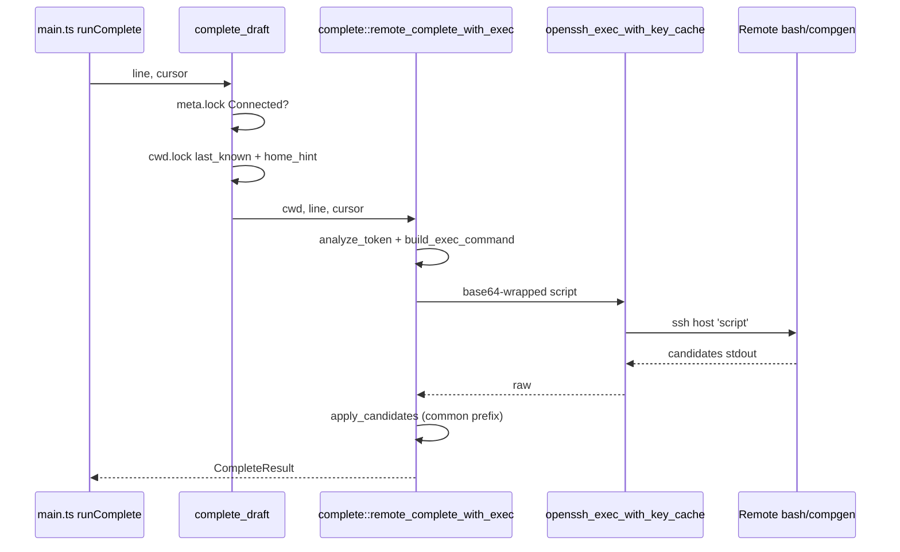
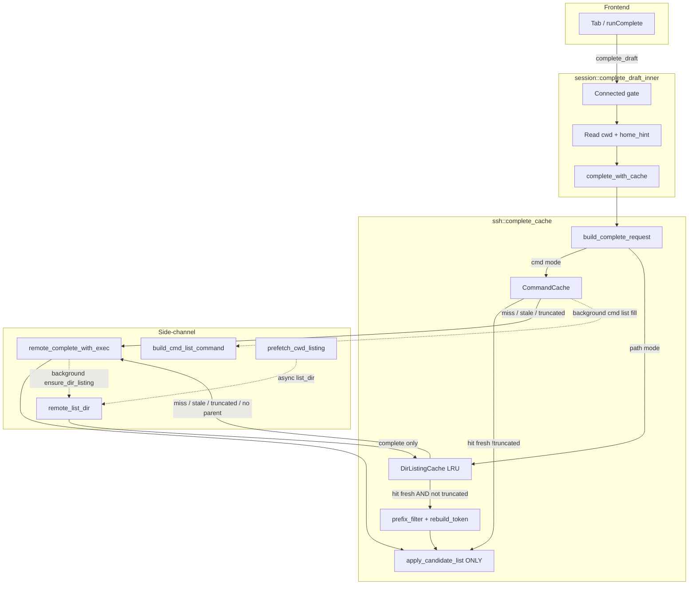
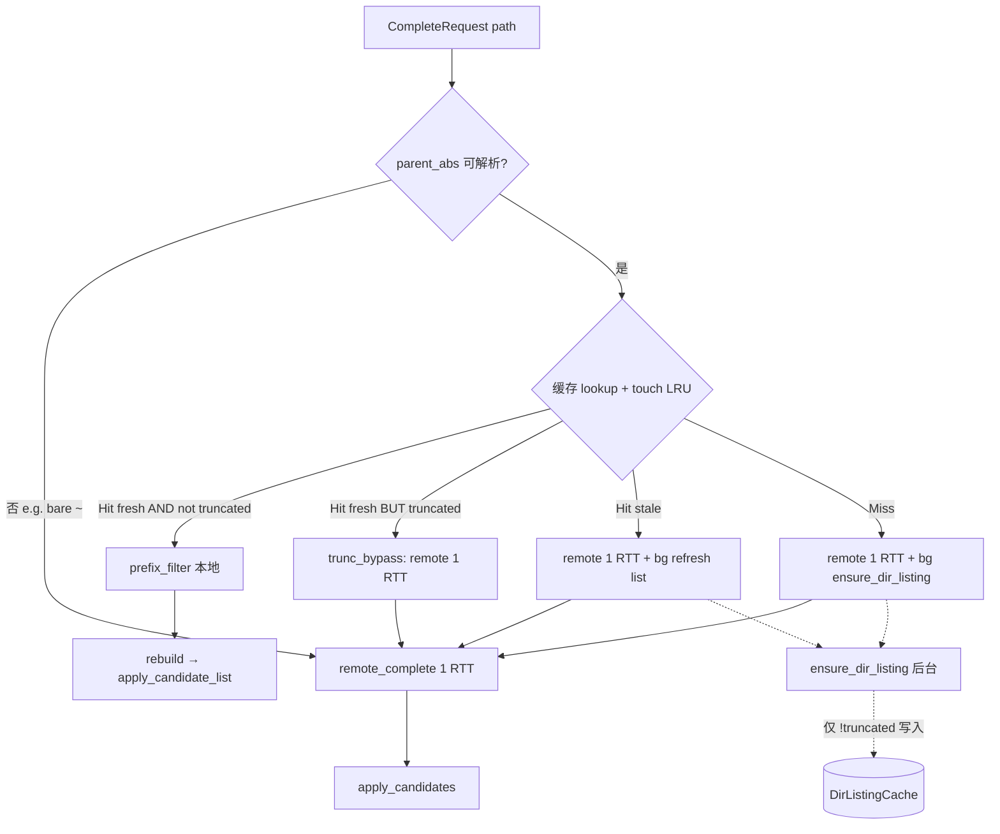

# Hybrid Offline Tab 补全缓存设计（Shell 模式）

| 字段 | 内容 |
|------|------|
| **文档标题** | Hybrid offline Tab completion cache for AnchorTerm (Shell mode) |
| **作者** | （待填） |
| **日期** | 2026-07-30 |
| **状态** | Draft（rev.3 — Tab 单 RTT + `~` 边角对齐） |
| **相关代码基线** | `src-tauri/src/ssh/complete.rs`、`session/mod.rs`、`app_state.rs`、`cwd/mod.rs`、`ssh/openssh.rs`、`src/main.ts` |
| **目标读者** | 熟悉侧信道 `complete_draft` 与 `CwdTracker` 的后端工程师 |
| **仓库副本** | `docs/design-hybrid-tab-complete-cache.md` |

---

## Overview

AnchorTerm 在 Shell 模式下通过侧信道 OpenSSH exec（`compgen`）实现 Xshell 风格的 Tab 补全，**不污染交互 PTY**。当前每次 Tab（已打开多候选列表的本地 cycling 除外）都会走完整远程往返：

`frontend invoke complete_draft` → `session::complete_draft_inner` → `ssh::complete::remote_complete_with_exec` → `openssh_exec_with_key_cache` → 远端 bash `compgen` 脚本。

在 Windows 上 `control_master_enabled()` 默认 **关闭**（`src-tauri/src/ssh/openssh.rs`），侧信道无法复用交互 TCP/鉴权，延迟尤其明显。

本设计采用 **Hybrid 缓存**：

1. **按目录直列缓存**（非递归 `find`）：缓存某目录的直接子项（`name` + `is_dir`）
2. **仅当 listing 完整（`!truncated`）且未过期时**，本地前缀过滤
3. **Tab 用户路径延迟优先**：miss/stale/truncated/不可解析时 **至多 1 次** token-scoped `remote_complete_with_exec`（与今日同量级）；**不**在 Tab 上串行 `list_dir` 再 `compgen`
4. **后台填缓存**：`list_dir` / `ensure_dir_listing` 由 prefetch 或 Tab 触发的 **fire-and-forget** 完成，供 *下一次* Tab 命中（truncated 结果不插入可用缓存）
5. **在 cwd 确认后预取**当前目录列表（OSC7 优先；另见 seed/restore 钩子）
6. **独立命令名缓存**（专用高上限 list 脚本 + 长 TTL；miss 策略见 §4.2，避免双 RTT）
7. **可选**：在变异命令提交后失效相关缓存

前端 `complete_draft(sessionId, line, cursor)` 与 `CompleteResult` 形状保持不变；改动集中在 Rust 后端。

---

## Background & Motivation

### 现状调用链



关键实现：

| 组件 | 路径 | 职责 |
|------|------|------|
| 远程补全 | `src-tauri/src/ssh/complete.rs` | `analyze_token`、`build_exec_command`、`apply_candidates`；`MAX_CANDIDATES=200`；`COMPLETE_TIMEOUT=6s` |
| 命令入口 | `src-tauri/src/session/mod.rs` ~1391+ | `complete_draft` / `complete_draft_inner`；锁 `meta` 再读 `cwd`（**今日仅 clone `last_known`，未 clone `home_hint`** — hybrid 必须扩展） |
| 会话态 | `src-tauri/src/app_state.rs` | `SessionRuntime`：`cwd`、`side_channel_key`、`control_path`、`cached`、`restore_target` 等 |
| CWD | `src-tauri/src/cwd/mod.rs` | OSC7 / OSC title / `CdParse` / `CdRollback`；`home_hint`；`expand_shell_path`（pub）；`normalize_abs_path`（**private** — 需公开为 `normalize_remote_abs`） |
| 侧信道 | `src-tauri/src/ssh/openssh.rs` | `openssh_exec_with_key_cache`；Windows 默认无 ControlMaster |
| 前端 Tab | `src/main.ts` ~1780+ | `runComplete`；多候选 cycling 用 `token_start`/`token_end` |

### 痛点

1. **每击必 RTT**：在高延迟或 Windows 无 mux 时，Tab 常需数百 ms～数秒。
2. **重复查询同一目录**：用户在 `cd fo` → `cd foo/` → `cd foo/b` 连续 Tab 时，父目录不变，仍重复全量远程。
3. **命令补全同样昂贵**：首词 `compgen -c/-a/-A function` 结果在会话内几乎不变，却每次远程拉取；且现网脚本 `head -n 200` 不足以填满会话级命令缓存。
4. **已否决「仅 `find` 1000」方案**：路径补全是**父目录段匹配**而非全树搜索；`../`、`~`、绝对路径、命令补全、缓存陈旧、乐观 `cd` 回滚、截断漏匹配等问题使该方案不适合作为唯一路径。

### 为何 Hybrid

Hybrid 保留远程真相源，同时把「同一目录下的连续前缀细化」变成本地操作，与 bash 交互习惯一致：先 `cd /u` 再 `cd /usr/l`，父目录列表可复用。

---

## Goals & Non-Goals

### Goals

1. **路径补全缓存命中**：仅在 **完整 listing**（`!truncated`）且未过期时本地前缀过滤，目标延迟 **&lt; 5–20ms**（无远程）。
2. **命令补全缓存**：会话内命令名结果长 TTL 复用；**专用 list 脚本**可拉取至多 `MAX_CMD_ENTRIES`（非 `MAX_CANDIDATES=200`）。
3. **正确性优先 + 延迟不劣化（修订措辞）**：
   - **miss / stale / truncated / 路径不可解析（含 bare `~`）** → Tab 走 **单次** token-scoped `remote_complete_with_exec`，行为与今日一致（trailing `/`、common-prefix、`token_start`/`token_end`）；**延迟同量级，禁止 2× RTT**。
   - **完整缓存命中路径** → 在 TTL 内 best-effort 与 bash 一致；允许短暂陈旧直至 TTL 或可选变异失效。
   - **禁止**用 `truncated` listing 的本地非空子集直接 `apply_candidates`（会错误 common-prefix）。
4. **不阻塞 PTY**：预取与补全侧信道不得占用交互 stdin；不得在 `on_data` 路径同步等待远程。
5. **锁安全**：遵守现有 `std::sync::Mutex` 非重入与锁顺序；新增锁不得引入死锁。
6. **前端零破坏**：`complete_draft` 签名与 `CompleteResult` 字段不变；**唯一**构造 `CompleteResult` 的路径为 `apply_candidate_list` / `apply_candidates`。
7. **可观测**：`ops_log` 记录 `cache_hit` / `miss` / `stale` / `prefetch` / `fallback` / `trunc_bypass`。
8. **内存有界**：按会话 LRU + 每目录条数上限；touch-on-get LRU。

### Non-Goals

| 项 | 说明 |
|----|------|
| 完整 bash programmable completion | 不实现 `complete -F`、`_git` 等 shell function |
| 递归模糊全树搜索作为主 UX | 不做 `find / -name` 式离线索引 |
| 纯前端离线缓存 | 缓存与路径解析在后端 |
| 磁盘持久化缓存 | 仅内存；断开/重连清空 |
| 改变 ControlMaster 默认策略 | Windows 仍默认 off；缓存是独立加速手段（mux 修复后可正交开启） |
| 修改草稿 cycling UI 协议 | 前端 `completeUi` 逻辑保持 |
| **首词含 `/` 的 path-like token 改走路径缓存** | 今日 `is_first_word → cmd`；`./bin`、`/usr/b` 仍走命令补全。Hybrid **不**加速此类（parity）；可选 P2：token 含 `/` 时改 path mode |

---

## Proposed Design

### 1. 高层架构



### 2. 新模块布局

| 路径 | 职责 |
|------|------|
| `src-tauri/src/ssh/complete_cache.rs` | **新建**：`DirListingCache`、`CommandCache`、`SessionCompleteCache`、`InFlightList`、`resolve_parent_abs`、前缀过滤、预取协调 |
| `src-tauri/src/ssh/complete.rs` | 公开 `analyze_token`、`apply_candidates` / **`apply_candidate_list`**、`common_prefix`、`parse_candidates`；新增 `build_list_dir_command`、`build_cmd_list_command`；保留 `remote_complete_with_exec` 作为 token-scoped 回退 |
| `src-tauri/src/cwd/mod.rs` | 将 `normalize_abs_path` 公开为 **`pub fn normalize_remote_abs`**（或薄包装），供 cache 与 cwd 共用，**禁止**复制私有实现导致语义漂移 |
| `src-tauri/src/ssh/mod.rs` | `pub mod complete_cache;` |
| `src-tauri/src/app_state.rs` | `SessionRuntime` 增加 `complete_cache: Mutex<SessionCompleteCache>` |
| `src-tauri/src/session/mod.rs` | `complete_draft_inner` 改走 hybrid；clone `(last_known, home_hint)`；connect/disconnect clear；`on_cwd_confirmed_for_cache`；prefetch 触发点 |
| `src-tauri/src/ssh/openssh.rs` | `apply_cwd_change` 末尾经薄封装调用 session 钩子（不把 list 逻辑塞进 openssh） |
| `src/main.ts` | **不改** API |

**依赖方向：**

- `complete_cache` → `complete` + `cwd`（`expand_shell_path`、`normalize_remote_abs`）
- `session` → `complete_cache` + `complete` + `openssh`
- Prefetch 调度：`session::on_cwd_confirmed_for_cache(rt, path, reason)`（类比 `shutdown_session_mux_public`），由 `apply_cwd_change`、`schedule_seed_login_pwd` 成功路径、restore playbook 成功路径、Connected 且已有 absolute `last_known` 时调用
- **禁止** `complete_cache` ↔ `openssh` 深耦合

### 3. 缓存数据结构

```rust
// src-tauri/src/ssh/complete_cache.rs

use std::collections::{HashMap, VecDeque};
use std::sync::Arc;
use std::time::{Duration, Instant};
use tokio::sync::Notify;

/// Direct child of a directory (not recursive).
#[derive(Debug, Clone)]
pub struct DirEntry {
    /// Basename only. May contain Unicode / spaces. No mid-path `/`.
    pub name: String,
    /// true → completion token gets trailing `/` (match complete.rs convention).
    pub is_dir: bool,
}

#[derive(Debug, Clone)]
pub struct DirListing {
    /// Normalized absolute POSIX path key, e.g. `/home/u/proj`
    /// (no trailing `/` except root `/`). Never Windows backslash keys.
    pub abs_dir: String,
    pub entries: Vec<DirEntry>,
    pub fetched_at: Instant,
    /// true if remote listing hit MAX_DIR_ENTRIES cap.
    /// **Any** use of a truncated listing for local filter is unsafe for
    /// completeness (not only the empty-filter case).
    pub truncated: bool,
}

#[derive(Debug)]
pub struct DirListingCache {
    map: HashMap<String, DirListing>,
    /// LRU: front = oldest / least recently used; back = most recent.
    order: VecDeque<String>,
    max_dirs: usize,
}

impl DirListingCache {
    pub fn new() -> Self {
        Self {
            map: HashMap::new(),
            order: VecDeque::new(),
            max_dirs: MAX_DIRS_LRU,
        }
    }

    /// Lookup; on hit **touch** (move key to back of LRU).
    pub fn get(&mut self, abs_dir: &str) -> Option<&DirListing> { /* touch-on-get */ }

    pub fn insert(&mut self, listing: DirListing) { /* push back; evict front if > max_dirs */ }

    pub fn invalidate(&mut self, abs_dir: &str) { /* remove from map + order */ }

    pub fn clear(&mut self) { self.map.clear(); self.order.clear(); }
}

#[derive(Debug, Clone)]
pub struct CommandCache {
    pub names: Vec<String>,
    pub fetched_at: Instant,
    /// true if remote returned >= MAX_CMD_ENTRIES (may miss later names).
    pub truncated: bool,
}

/// Shared in-flight directory list so Tab and prefetch await the same work.
#[derive(Debug)]
pub struct InFlightList {
    /// Session epoch when this request started; discard if epoch changed.
    pub epoch: u64,
    /// Per-path generation; bump to cancel waiters for this dir only.
    pub path_gen: u64,
    /// Filled when remote list completes (Ok or Err).
    pub result: Arc<std::sync::Mutex<Option<Result<DirListing, String>>>>,
    pub notify: Arc<Notify>,
}

/// Per-session aggregate (held under SessionRuntime.complete_cache).
#[derive(Debug)]
pub struct SessionCompleteCache {
    pub dirs: DirListingCache,
    pub commands: Option<CommandCache>,
    /// abs_dir → shared in-flight list (NOT a bare generation counter).
    pub inflight: HashMap<String, Arc<InFlightList>>,
    /// Bumped on disconnect / connect-start full clear so late results drop.
    pub epoch: u64,
    /// Per-path cancel generation (CdRollback of wrong optimistic path).
    pub path_gens: HashMap<String, u64>,
}

impl Default for SessionCompleteCache {
    fn default() -> Self {
        Self {
            dirs: DirListingCache::new(),
            commands: None,
            inflight: HashMap::new(),
            epoch: 0,
            path_gens: HashMap::new(),
        }
    }
}
```

#### 常量（含理由）

| 常量 | 建议值 | 理由 |
|------|--------|------|
| `MAX_DIRS_LRU` | **64** | 典型浏览深度有限 |
| `MAX_DIR_ENTRIES` | **2000** | 大于返回上限 200；超限标 `truncated` |
| `DIR_TTL` | **90s** | 浏览期复用 vs 陈旧风险折中 |
| `CMD_TTL` | **15 min** | PATH/alias 会话内很少变 |
| `MAX_CMD_ENTRIES` | **5000** | 专用 cmd list 脚本的 `head -n`；**不是** `MAX_CANDIDATES` |
| `MAX_CANDIDATES` | **200**（沿用） | **仅**返回前端 / token-scoped `build_exec_command` 的截断 |
| `PREFETCH_TIMEOUT` | **4s** | 略短于 complete 超时 |
| `COMPLETE_TIMEOUT` | **6s**（沿用） | Tab 用户等待上限 |
| 内存粗算 | 64×2000×~64B ≈ **8MB/session** 上限 | 多 tab 极端远低于此（实际条目少） |

```rust
const MAX_DIRS_LRU: usize = 64;
const MAX_DIR_ENTRIES: usize = 2000;
const DIR_TTL: Duration = Duration::from_secs(90);
const CMD_TTL: Duration = Duration::from_secs(15 * 60);
const MAX_CMD_ENTRIES: usize = 5000;
const PREFETCH_TIMEOUT: Duration = Duration::from_secs(4);
```

**LRU 策略（锁定）：**

- `get` / 成功用于 Tab 的 hit → **touch**：将该 `abs_dir` 移到 `order` 末尾
- `insert` → 已存在则先摘除再推末尾；`order.len() > max_dirs` 时从 **front** 驱逐
- `DirListingCache::new()` 使用 `MAX_DIRS_LRU`；**不要**依赖不完整的 `#[derive(Default)]` 把 `max_dirs` 变成 0

#### Key 归一化与 `resolve_parent_abs`（完整算法）

缓存键必须是 **POSIX 绝对路径字符串**（`/` 分隔）。在 Windows 本地构建时：

1. 用逻辑组件栈归一化（与 `cwd::normalize_abs_path` 相同）
2. **禁止**把 `PathBuf::display()` / 反斜杠写入 cache key
3. 公开 `cwd::normalize_remote_abs(path: &str) -> String`（从 private `normalize_abs_path` 提升）

**`split_token_dir_and_name`：**

```rust
/// "foo/bar" → ("foo/", "bar"); "foo/" → ("foo/", ""); "x" → ("", "x"); "/" → ("/", "")
fn split_token_dir_and_name(token: &str) -> (String, String) {
    match token.rfind('/') {
        Some(i) => (token[..=i].to_string(), token[i + 1..].to_string()),
        None => (String::new(), token.to_string()),
    }
}
```

**`resolve_parent_abs` 伪代码（锁定）：**

```text
fn resolve_parent_abs(token, cwd: Option<&str>, home_hint: Option<&str>) -> Option<String>:
    // 0. Bare tilde / other-user tilde → force remote (parent_abs = None).
    //    split("~") would give ("", "~") and wrongly treat name_prefix="~" under cwd.
    //    Today remote: compgen -d -- "~" expands home; local filter cannot match that.
    if token == "~" || is_other_user_tilde(token):  // ~user or ~user/... without our home_hint
        return None
    // is_other_user_tilde: starts with '~' and not "~/" and not exactly handled by expand;
    // bare "~" already returned; "~alice" / "~alice/x" → None (no home for alice).

    // 1. Split typed token into directory part (as typed) + name prefix.
    let (token_dir_prefix, _name_prefix) = split_token_dir_and_name(token)

    // 2. Resolve a base absolute cwd when needed.
    fn abs_cwd(cwd, home_hint) -> Option<String>:
        let c = cwd?;
        if c.starts_with('/') { return Some(normalize_remote_abs(c)) }
        if c.starts_with('~') {
            // last_known may be non-absolute "~/proj" (cwd::resolve_path)
            return expand_shell_path(c, home_hint).filter(|p| p.starts_with('/'))
        }
        return None  // relative unknown base

    // 3. Empty dir part → parent is absolute cwd.
    //    (token "~" already handled in step 0; name_prefix "fo" under cwd is normal.)
    if token_dir_prefix.is_empty():
        return abs_cwd(cwd, home_hint)

    // 4. Strip trailing slash for join except keep root "/".
    let dir_part = token_dir_prefix  // e.g. "foo/", "/tmp/", "~/", "../", "foo/../b/"
    let dir_for_resolve = if dir_part == "/" { "/" }
                          else { dir_part.trim_end_matches('/') }
    // Note: "foo/" → "foo"; "~/" → "~"; "a/b/" → "a/b"

    // 5. Expand dir_for_resolve to absolute:
    if dir_for_resolve.starts_with("~/") || dir_for_resolve == "~":
        // dir_for_resolve == "~" only from token_dir_prefix "~/" after trim → home
        // ~otheruser path segments → expand_shell_path None → remote fallback
        return expand_shell_path(dir_for_resolve, home_hint)
                .map(|p| normalize_remote_abs(&p))
    if dir_for_resolve.starts_with('/'):
        return Some(normalize_remote_abs(dir_for_resolve))
    // relative: need abs_cwd
    let base = abs_cwd(cwd, home_hint)?;
    return Some(normalize_remote_abs(&format!("{base}/{dir_for_resolve}")))
```

**边角表：**

| token | cwd | home_hint | parent_abs | name_prefix | 说明 |
|-------|-----|-----------|------------|-------------|------|
| `""` / `"fo"` | `/home/u/a` | — | `/home/u/a` | `""` / `"fo"` | 常规相对 |
| `"foo/"` | `/home/u/a` | — | `/home/u/a/foo` | `""` | |
| `"foo/ba"` | `/home/u/a` | — | `/home/u/a/foo` | `"ba"` | |
| `"/"` | any | — | `/` | `""` | |
| `"/tm"` | any | — | `/` | `"tm"` | |
| `"/tmp/x"` | any | — | `/tmp` | `"x"` | |
| `"../b"` | `/home/u/a` | — | `/home/u` | `"b"` | |
| `"../"` | `/home/u/a` | — | `/home/u` | `""` | |
| `"~/c"` | any | `/home/u` | `/home/u` | `"c"` | `~/` 前缀可本地 |
| `"~/"` | any | `/home/u` | `/home/u` | `""` | |
| `"~"` | any | any | **`None`** | （不计） | **强制 remote**；勿当 cwd 下 basename `~` |
| `"~alice"` / `"~alice/x"` | any | — | **`None`** | （不计） | 无 other-user home → remote |
| `"foo/../ba"` | `/home/u/a` | — | `/home/u/a` | `"ba"` | `split`→`("foo/../","ba")` → normalize |
| `"foo//b"` | `/home/u/a` | — | `/home/u/a/foo` | `"b"` | `//` 折叠 |

**`foo/../ba` 演算：** `token_dir_prefix="foo/../"` → `dir_for_resolve="foo/.."` → join cwd → `/home/u/a/foo/..` → normalize → `/home/u/a`。

**`last_known="~/proj"`（非绝对）:**

- 若 `home_hint=Some("/home/u")` → `abs_cwd` = `/home/u/proj`
- 若无 home_hint → `abs_cwd` = None → 相对 token **无法**解析 → remote fallback

**`~otheruser` / bare `"~"`:** step 0 → `parent_abs = None` → Tab **仅** `remote_complete`（与今日 `compgen -- "~"` 一致；**禁止**本地把 `"~"` 当成 cwd 下的 name_prefix）。

**空格 / 引号：**

- `analyze_token` **v1 不解析引号**（whitespace-separated）；token 本身不含空格
- listing **basename 可含空格**（见 list 脚本 `\t` 分隔）；非法 UTF-8 用 lossy 或丢弃该行
- basename 含 `\t` / `\n`：**不支持**，parse 时丢弃该行并 debug 日志

**返回候选重建（与今日 compgen 的 token 形态一致）：**

```text
token = "foo/ba", match name="bar", is_dir=true  → "foo/bar/"
token = "/tm",    match name="tmp", is_dir=true  → "/tmp/"
token = "ba",     match name="bar", is_dir=false → "bar"
```

### 4. 补全算法

#### 4.1 请求分析

保留现有 `analyze_token`：

- `(token_start, token_end, token, head, is_first_word, prefer_dirs)`
- `prefer_dirs` 仅对 `cd` / `pushd` / `rmdir`

```rust
#[derive(Debug, Clone, Copy, PartialEq, Eq)]
pub enum CompleteMode { Cmd, Dir, File }

#[derive(Debug, Clone)]
pub struct CompleteRequest {
    pub mode: CompleteMode,
    pub token: String,
    pub token_start: usize,
    pub token_end: usize,
    pub name_prefix: String,
    pub parent_abs: Option<String>,
    pub token_dir_prefix: String,
    pub cwd_abs: Option<String>,
}

fn build_complete_request(
    line: &str,
    cursor: usize,
    cwd: Option<&str>,
    home_hint: Option<&str>,
) -> CompleteRequest {
    let chars: Vec<char> = line.chars().collect();
    let cursor = cursor.min(chars.len());
    let (token_start, token_end, token, _head, is_first_word, prefer_dirs) =
        analyze_token(&chars, cursor);

    // Parity with today: first word is ALWAYS cmd mode, even if token looks
    // like a path (./bin, /usr/b). Path cache does not apply (see Non-Goals).
    let mode = if is_first_word {
        CompleteMode::Cmd
    } else if prefer_dirs {
        CompleteMode::Dir
    } else {
        CompleteMode::File
    };

    if mode == CompleteMode::Cmd {
        return CompleteRequest {
            mode,
            name_prefix: token.clone(),
            parent_abs: None,
            token_dir_prefix: String::new(),
            token,
            token_start,
            token_end,
            cwd_abs: cwd.and_then(|c| /* abs only */ abs_cwd_opt(c, home_hint)),
        };
    }

    let (token_dir_prefix, name_prefix) = split_token_dir_and_name(&token);
    let parent_abs = resolve_parent_abs(&token, cwd, home_hint);
    CompleteRequest {
        mode,
        token,
        token_start,
        token_end,
        name_prefix,
        parent_abs,
        token_dir_prefix,
        cwd_abs: abs_cwd_opt(cwd.unwrap_or(""), home_hint), // helper
    }
}
```

#### 4.2 Hybrid 主路径

```rust
pub async fn complete_with_cache<F, Fut>(...) -> Result<CompleteResult, String> {
    let req = build_complete_request(...);
    match req.mode {
        CompleteMode::Cmd => complete_cmd(...).await,
        CompleteMode::Dir | CompleteMode::File => complete_path(...).await,
    }
}
```

**路径补全 — 用户延迟优先 + 截断安全（锁定，Issue 1 + Issue 17）：**

**原则：** Tab 关键路径 **至多 1 次侧信道 RTT**（与今日 `remote_complete_with_exec` 同量级）。`list_dir` **永不**作为 Tab 响应的前置串行步骤；仅用于 prefetch / 后台填充，供后续 Tab 本地命中。



| 情况 | **Tab 响应（用户可见）** | **后台（不阻塞响应）** |
|------|--------------------------|------------------------|
| `parent_abs` 无法解析（含 bare `"~"`、`~otheruser`） | **`remote_complete_with_exec`（1 RTT）** | 无 list（无绝对父目录） |
| Cache **hit**、fresh、**`!truncated`** | 本地 `prefix_filter` → `apply_candidate_list`（0 RTT） | 无 |
| Cache **hit**、fresh、**`truncated`** | `trunc_bypass` → **`remote_complete`（1 RTT）**；**禁止**本地 apply | 可选：不重复 list；或忽略该坏缓存条目 |
| Cache **hit** 但 **stale** | **fail-closed：`remote_complete`（1 RTT）**；**不** stale-serve；**不** await `list_dir` | `ensure_dir_listing`：成功且 `!truncated` 则替换缓存；truncated/失败则不写可用缓存 |
| Cache **miss** | **`remote_complete`（1 RTT）** — **parity with today** | 同上 `ensure_dir_listing`（truncated **不插入** 供 hit 的缓存） |
| 本地 filter（仅完整 hit）非空/空 | rebuild / empty + 响铃 | 无 |
| 已有同 dir **inflight list** 且即将完成 | **可选微优化**（非必须）：短等待 ≤50–100ms；若拿到 `!truncated` 则本地 apply，否则立即 `remote_complete`。**禁止**为等 list 拖到完整 RTT | 共享 `InFlightList` |
| Prefetch 触发 | 不服务 Tab | 仅 `list_dir` |

**禁止的反模式（Issue 17）：**

```text
// BAD — 大目录上比今日慢 2×
listing = await list_dir(parent)   // RTT 1
if listing.truncated { return await remote_complete(...) }  // RTT 2
else { return local_filter(listing) }
```

```text
// GOOD — Tab 路径
if let Some(hit) = cache.get_fresh_complete(parent) {
    return apply_local(hit);
}
let result = await remote_complete(...);  // exactly one user-facing RTT
spawn ensure_dir_listing(parent);         // next Tab may hit
return result;
```

**为何 truncated 一律不信任本地非空子集：**

`find`/`ls` 顺序不保证按用户前缀完备；本地命中子集上的 common-prefix 会错误缩短/扩展 token。`truncated` = **任意前缀都可能不完整**。

**P0 缓存价值：** 小目录经 prefetch 或「上次 Tab 后台 list」后 → 后续 Tab 0 RTT。大目录 `/usr/lib` 每次 Tab 仍 **1×** token-scoped remote（**不差于今日**）；后台 list 若 truncated 则不污染 hit 路径。

**命令补全 `complete_cmd`（同样禁止双 RTT）：**

| 情况 | Tab 响应 | 后台 |
|------|----------|------|
| `commands` fresh、**`!truncated`** | 本地前缀过滤 → `apply_candidate_list` | 无 |
| `commands` fresh、**`truncated`** | token-scoped cmd `compgen`（1 RTT，`head -n 200` 仅限返回） | 无强制重填 |
| miss / stale | **token-scoped `remote_complete` / cmd compgen（1 RTT）** | 异步 `build_cmd_list_command(MAX_CMD_ENTRIES)` 填 `CommandCache`（`truncated` 标志照常）；**不要** await 全量 5000 列表再决定是否二次 remote |
| 远程失败 | 返回错误（与今日一致） | 可重试 fill |

#### 4.3 本地过滤与 **唯一** CompleteResult 出口

```rust
fn prefix_filter<'a>(
    entries: &'a [DirEntry],
    name_prefix: &str,
    dirs_only: bool,
) -> Vec<&'a DirEntry> { /* starts_with; dirs_only => is_dir */ }

fn rebuild_candidates(token_dir_prefix: &str, matches: &[&DirEntry]) -> Vec<String> {
    // token_dir_prefix + name + optional '/'
}

/// ONLY construction path for CompleteResult in hybrid (PR1 acceptance).
pub fn apply_candidate_list(
    line: String,
    cursor: usize,
    token_start: usize,
    token_end: usize,
    token: &str,
    mut candidates: Vec<String>,
) -> CompleteResult {
    candidates.sort();
    candidates.dedup();
    if candidates.len() > MAX_CANDIDATES {
        candidates.truncate(MAX_CANDIDATES);
    }
    // Same common-prefix / single / list_only logic as apply_candidates,
    // including new_token_end = token_start + applied_len for frontend cycle.
    ...
}
```

**禁止：**

- Hybrid 直接拼 `CompleteResult { candidates: basenames, ... }` 绕过 apply
- 为调试新增 `CompleteResult` 字段（前端无 ignore 策略）

**与前端 cycling：** 必须得到与今日相同的 `token_end` 更新规则（见 `apply_common_prefix_updates_token_end_for_cycle` 测试）。

#### 4.4 远程 list_dir — 完整脚本模板

`build_list_dir_command(abs_dir: &str, max: usize) -> String` 与 `build_exec_command` 同安全模型：

```rust
fn build_list_dir_command(abs_dir: &str, max: usize) -> String {
    let script = format!(
        r#"set +e
b64d() {{
  if command -v base64 >/dev/null 2>&1; then
    printf '%s' "$1" | base64 -d 2>/dev/null || printf '%s' "$1" | base64 --decode 2>/dev/null
  elif command -v openssl >/dev/null 2>&1; then
    printf '%s' "$1" | openssl base64 -d -A 2>/dev/null
  else
    printf ''
  fi
}}
DIR=$(b64d '{dir_b64}')
MAX={max}
# Marker lines for the client parser (ASCII, single line each).
# OK | ERR_CD | ERR_LIST
if ! cd -- "$DIR" 2>/dev/null; then
  printf '%s\n' 'ERR_CD'
  exit 0
fi
# Collect basenames. Prefer find; BusyBox/no-find → ls -1A.
# Skip . and .. explicitly. Include hidden (compgen parity for ".foo").
# is_dir: follow bash `[ -d ]` semantics (symlink-to-dir counts as dir).
# Sort for deterministic truncation (same first MAX every time).
tmp=$(mktemp 2>/dev/null || printf '/tmp/.anchorterm_ls_%s' "$$")
if command -v find >/dev/null 2>&1; then
  # %f = basename; do not print DIR itself
  find . -mindepth 1 -maxdepth 1 \( -name . -o -name .. \) -prune -o -print 2>/dev/null \
    | sed 's|^\./||' > "$tmp" 2>/dev/null
else
  ls -1A 2>/dev/null > "$tmp"
fi
if [ ! -s "$tmp" ] && [ ! -f "$tmp" ]; then
  printf '%s\n' 'ERR_LIST'
  rm -f "$tmp" 2>/dev/null
  exit 0
fi
# Count before head for truncation signal
total=$(wc -l < "$tmp" 2>/dev/null | tr -d ' ')
printf '%s\n' 'OK'
if [ "${total:-0}" -gt "$MAX" ] 2>/dev/null; then
  printf 'TRUNCATED\n'
else
  printf 'FULL\n'
fi
sort -u "$tmp" 2>/dev/null | head -n "$MAX" | while IFS= read -r name; do
  # Drop names with tab/newline (unsupported)
  case "$name" in
    *"$TAB"*|*'
'*) continue ;;
  esac
  if [ -d "$name" ]; then
    printf 'd\t%s\n' "$name"
  else
    printf 'f\t%s\n' "$name"
  fi
done
rm -f "$tmp" 2>/dev/null
exit 0
"#,
        dir_b64 = b64(abs_dir.as_bytes()),
        max = max,
        // Note: implementers should inject TAB=$'\t' or use $'\t' carefully;
        // simpler: reject lines where cut -f1 is not exactly d or f.
    );
    let script_b64 = b64(script.as_bytes());
    format!(
        "echo {script_b64} | (base64 -d 2>/dev/null || base64 --decode 2>/dev/null || openssl base64 -d -A 2>/dev/null) | bash --noprofile --norc"
    )
}
```

**实现注记（脚本落地时允许微调，语义锁定）：**

1. 输出首行：`OK` | `ERR_CD` | `ERR_LIST`
2. 次行（仅 OK）：`FULL` | `TRUNCATED`
3. 随后行：`d\tbasename` 或 `f\tbasename`（`basename` 可含空格；**不可**含 tab）
4. **`[ -d "$name" ]`**：symlink→dir 视为 dir（对齐 bash/`compgen` 补 `/`）
5. **排序后 `head -n MAX`**：截断确定性；`TRUNCATED` 当 total &gt; MAX
6. **含 hidden**：`ls -1A` / find 不排除 dotfiles（Open Question #2 关闭为：**包含**）
7. **`cd` 失败 → `ERR_CD`**：客户端 **不写** empty `DirListing`；Tab 走 `remote_complete_with_exec`（避免「权限不足被当成真无匹配」）
8. **无 `find`**：`ls -1A` 回退（对齐现网无 compgen 时的 ls 风格）
9. **无 `mktemp`**：可用管道 `sort | head` 直接处理，避免临时文件（实现可选优化）
10. 客户端 `parse_listing(raw) -> Result<(Vec<DirEntry>, bool truncated), ListError>`

```rust
enum ListError { CdFailed, ListFailed, ParseError }

fn parse_listing(raw: &str) -> Result<(Vec<DirEntry>, bool), ListError> {
    let mut lines = raw.lines().map(|l| l.trim_end_matches('\r'));
    match lines.next().unwrap_or("") {
        "ERR_CD" => return Err(ListError::CdFailed),
        "ERR_LIST" => return Err(ListError::ListFailed),
        "OK" => {}
        _ => return Err(ListError::ParseError),
    }
    let truncated = match lines.next().unwrap_or("") {
        "TRUNCATED" => true,
        "FULL" => false,
        _ => return Err(ListError::ParseError),
    };
    let mut entries = Vec::new();
    for line in lines {
        if line.is_empty() { continue; }
        let Some((kind, name)) = line.split_once('\t') else { continue; };
        if name.is_empty() || name.contains('\t') { continue; }
        let is_dir = kind == "d";
        if kind != "d" && kind != "f" { continue; }
        entries.push(DirEntry { name: name.to_string(), is_dir });
    }
    Ok((entries, truncated))
}
```

#### 4.5 命令 list 脚本（PR3 强制，非复用 head -n 200）

**禁止**用现有 `build_exec_command(..., is_first_word=true)` 填充 `CommandCache`：其 `head -n MAX_CANDIDATES`（200）会永久丢掉字母序靠后的命令。

```rust
/// Dedicated command inventory for CommandCache fill.
/// `max` MUST be MAX_CMD_ENTRIES (5000), not MAX_CANDIDATES (200).
fn build_cmd_list_command(max: usize) -> String {
    // Same base64 | bash wrapper. Body:
    //   { compgen -c; compgen -a; compgen -A function; } | awk 'NF' | sort -u | head -n MAX
    // Print OK / FULL|TRUNCATED then one command name per line (no d/f prefix).
    // truncated client-side: names.len() >= max OR remote TRUNCATED marker.
}
```

- **后台 fill**（非 Tab 关键路径）：一次侧信道 RTT 拉最多 `MAX_CMD_ENTRIES`（可接受，用户不等待）
- Tab miss 时：用户只等 **token-scoped** 1 RTT；fill 并行/事后
- 返回 UI 时仍 `truncate(MAX_CANDIDATES)` 在 `apply_candidate_list` 内
- `CommandCache.truncated = true` 当拉取行数达到 `max`；truncated 的 CommandCache **不得**用于本地 hit

#### 4.6 何时 list vs token-scoped compgen

| 场景 | 选择 | 是否计入用户 Tab 延迟 |
|------|------|------------------------|
| Prefetch / 后台 `ensure_dir_listing` | `build_list_dir_command` | 否 |
| Tab 且完整 listing fresh | 本地 filter | 0 RTT |
| Tab miss / stale / truncated / 无 parent / bare `~` | **`remote_complete_with_exec` only** | **1 RTT（锁定上限）** |
| 命令 cache 完整 hit | 本地 filter | 0 RTT |
| 命令 miss / stale / truncated | token-scoped cmd + 后台 `build_cmd_list_command` | **1 RTT** |
| **禁止** Tab 上 `await list_dir` 再视 truncated 决定 | — | 会导致 2 RTT |

### 5. Prefetch

#### 触发检查表（完整）

| 事件 | 位置 | 是否 prefetch | 说明 |
|------|------|---------------|------|
| OSC 7 | `openssh::apply_cwd_change` → `Osc7` | **是** | 路径 absolute 时 |
| OSC title | `apply_cwd_change` → `OscTitle` | **是** | 仅当 path **实际变化**并 emit 时（title 分支已过滤纯 home 覆盖） |
| 乐观 `cd` | `submit_line_inner` `CdParse` | **否** | 失败会 rollback |
| 回滚 | `CdRollback` | **否**；**取消该错误路径 inflight**（`path_gens[wrong]++`） | 不用全局 epoch 误杀其它目录 |
| `schedule_seed_login_pwd` 成功 | `session/mod.rs` ~789–798 **不经** `apply_cwd_change` | **是** | **必须单独接线** |
| Restore playbook 成功 `tracker.set` + `emit_cwd` | `run_restore_playbook` | **是** | 恢复目录 absolute 时 |
| Connected 且已有 absolute `last_known` | connect 成功路径末尾 | **是**（若尚未 inflight/cached） | 覆盖 provisional home |
| Disconnect / connect-start clear | — | clear all；`epoch++` | 见 §6 |

P0 **不做** CdParse debounce prefetch。P1 可选。

#### Inflight 合并（可实现设计，锁定）

**P0 选型（PR1–PR2）：真实共享 future，不做「双发可接受」懒方案。** Windows 无 mux 时双 `ssh` 正是要减少的痛点。

```text
ensure_dir_listing(abs_dir) -> Result<DirListing, String>:
  // Used by: prefetch, and Tab **background** fill after remote_complete.
  // NOT on the critical path that blocks returning CompleteResult (except optional
  // ≤50–100ms poll when already inflight — see §4.2).
  //
  // 1. Under complete_cache std mutex (brief):
  //    - if complete hit fresh && !truncated → return clone, drop lock
  //    - if inflight has entry with matching epoch & path_gen → clone Arc, drop lock
  //    - else create InFlightList, insert, drop lock, set need_start=true
  // 2. If need_start: await openssh_exec(list_dir) **unlocked**
  //    then: lock complete_cache; if epoch/path_gen match:
  //      if Ok(listing) && !truncated { dirs.insert }
  //      if truncated { do NOT insert for hit; log }
  //      store result; remove inflight; notify
  // 3. Joiners: notified().await; re-check epoch/path_gen
```

规则：

- **`inflight` map 条目在 insert 后移除**；**绝不**在持有 `complete_cache` 时 await ssh
- `InFlightList.result` 用 `std::sync::Mutex` 存 `Option<Result<...>>`
- Prefetch 与 Tab **后台** fill 共享 `ensure_dir_listing`（合并，避免双 ssh）
- Tab **前台**默认：`remote_complete` 与 `spawn(ensure_dir_listing)` 可并行；**不要** `await ensure` 后再 `remote_complete`
- CdRollback：`path_gens[bad_path] += 1`；完成后 gen 不匹配 → 不写缓存
- Disconnect：`epoch += 1`；clear all

#### 其它约束

1. **不阻塞** `on_data`、`submit_line`、PTY：`tokio::spawn`
2. Prefetch 使用 `PREFETCH_TIMEOUT`；失败仅日志
3. Prefetch spawn 前 clone：`ConnectParams`（from `cached`）、`control_path`、`epoch`、`path_gen` — **全部在 `complete_cache` 之外完成**

### 6. 失效（Invalidation）

| 机制 | 行为 |
|------|------|
| **TTL** | 读时检查 `DIR_TTL` / `CMD_TTL` |
| **LRU 驱逐** | 超 `MAX_DIRS_LRU`；touch-on-get |
| **Disconnect** | `clear_session_cache` + `epoch++`（与 `disconnect_inner` / teardown） |
| **Connect start** | 与 `clear_side_channel_key` **相同位置**（`session/mod.rs` ~130 用户发起 connect）再 clear 一次，防止「同一 `SessionRuntime` 重连未走 disconnect clear」残留**上一主机**目录缓存 |
| **Reconnect 成功** | 缓存应已在 connect-start 清空；再依赖 prefetch |
| **变异命令（P1 可选）** | 首词 ∈ 变异集 → 失效当前 cwd listing（保守） |

**变异命令启发式（可选）：** `mkdir`/`rmdir`/`touch`/`rm`/`mv`/`cp`/`ln`/`tar`/`unzip` 等 → `dirs.invalidate(cwd)` 或解析失败则仅 cwd；`export PATH` / `hash -r` → `commands=None`。

### 7. `SessionRuntime` 与锁顺序

#### 新增字段

```rust
pub complete_cache: Mutex<SessionCompleteCache>,  // std::sync::Mutex
```

#### 完整锁顺序与硬性规则

| 等级 | 锁 | 说明 |
|------|-----|------|
| 1 | `meta` | 状态机 / snapshot 前半 |
| 2 | `cwd` | last_known / home_hint |
| 3 | `restore_target` | 常与 cwd 事件相邻；**勿在 complete_cache 之后取** |
| 4 | `cached` | ConnectParams 克隆 |
| 5 | `control_path` | mux path 克隆 |
| 6 | `transport` | stdin 写 |
| 7 | `complete_cache` | 仅短持有；**最后**一类「逻辑状态」锁之一 |
| 8 | `side_channel_key` | 仅 `openssh_exec` 内短暂 |
| — | `echo_suppress` / `last_stty` / `remote_stty` | 与 complete 无关；勿与 complete_cache 交织 |

**硬性规则（扩展 Issue 6）：**

1. **禁止**在持有 `complete_cache` 时再获取：`meta`、`cwd`、`cached`、`restore_target`、`transport`、`control_path`
2. **禁止**在持有任一 `SessionRuntime` 的 `std::sync::Mutex` 时 `await` 远程
3. Prefetch / complete 异步路径模板：
   ```text
   meta.lock → Connected? → drop
   cached.lock → clone ConnectParams → drop
   control_path.lock → clone → drop
   cwd.lock → clone (last_known, home_hint) → drop   // complete path
   // optional: complete_cache brief for hit / inflight join
   await exec
   complete_cache.lock → insert if epoch ok → drop
   ```
4. `snapshot()` 仍为 meta→cwd；调用前释放 cwd/meta（现有注释）
5. 钩子用 `session::on_cwd_confirmed_for_cache` 薄封装，避免 openssh 堆业务逻辑

### 8. API 表面

#### 前端（不变）

```typescript
invoke<CompleteResult>("complete_draft", { sessionId, line, cursor })
// fields: line, cursor, candidates, token_start, token_end
// main.ts accepts snake_case and camelCase for token range
```

#### 后端内部

```rust
// complete_cache.rs
pub async fn complete_with_cache<F, Fut>(...) -> Result<CompleteResult, String>;
pub fn schedule_prefetch(rt: Arc<SessionRuntime>, abs_dir: String);
pub fn clear_session_cache(rt: &SessionRuntime); // epoch++
pub fn on_path_invalidated(rt: &SessionRuntime, abs_dir: &str); // path_gen++
pub fn note_mutating_submit(...); // optional PR4

// complete.rs
pub fn apply_candidate_list(...) -> CompleteResult; // preferred
pub fn apply_candidates(...) -> Result<CompleteResult, String>; // raw stdout path
pub fn build_list_dir_command(abs_dir: &str, max: usize) -> String;
pub fn build_cmd_list_command(max: usize) -> String; // PR3
pub async fn remote_complete_with_exec(...);

// cwd/mod.rs
pub fn normalize_remote_abs(path: &str) -> String;

// session
pub fn on_cwd_confirmed_for_cache(rt: Arc<SessionRuntime>, path: &str, reason: CwdChangeReason);
```

#### Feature flag

```text
ANCHORTERM_COMPLETE_CACHE=0|false|off  → 强制 remote_complete_with_exec（旧路径）
默认 on（未设置即启用）
```

风格对齐 `ANCHORTERM_SSH_MUX`。

#### PR1 `complete_draft_inner` checklist（强制）

```text
1. meta → Connected?
2. cwd.lock → clone last_known AND home_hint → drop   // NEW vs today
3. if flag off → remote_complete_with_exec(cwd only) as today
4. else → complete_with_cache(..., home_hint, exec closure)
5. exec closure: clone params/control_path; openssh_exec_with_key_cache
6. All CompleteResult via apply_candidate_list / apply_candidates only
```

### 9. 日志（ops_log）

| 事件 | 示例 |
|------|------|
| 分析 | `complete analyze mode=file parent=/tmp prefix=fo` |
| 命中 | `complete cache_hit kind=dir dir=/tmp filtered=3 truncated=false ms=2` |
| 截断绕过 | `complete trunc_bypass dir=/usr/lib reason=truncated_listing` |
| 未命中 | `complete cache_miss kind=dir dir=/tmp serve=remote_complete bg_list=1` |
| 过期 | `complete cache_stale dir=/tmp serve=remote_complete bg_list=1` |
| 回退 | `complete remote_fallback reason=no_parent\|bare_tilde\|trunc_bypass\|flag_off` |
| 预取 / 后台 list | `complete prefetch\|bg_list start\|ok\|truncated_skip\|skip_epoch dir=...` |
| 失效 | `complete cache_clear reason=disconnect\|connect_start` |
| 命令缓存 | `complete cmd_cache_miss serve=remote bg_fill=1` / `cmd_cache_fill n=1200 truncated=false` |

路径用 `text_preview`；禁止 password/passphrase。

### 10. 延迟目标与预算

| 路径 | 目标 |
|------|------|
| 完整 cache hit | **&lt; 5–20ms** |
| Miss / stale / truncated / bare `~` | **恰好 1×** 与今日相同的 token-scoped RTT（**禁止**串行 list+compgen） |
| 同目录后续 Tab（小目录，后台/prefetch 已填完整 list） | 0 RTT hit |
| 大目录（listing 必 truncated） | 每次 Tab 仍 1× remote（不差于今日）；后台 list 可不写缓存 |
| Prefetch + 后台 fill 同目录 | **同一 `InFlightList`**，不双开 list ssh |
| Tab remote + 后台 list 并行 | 允许 **2 条并发侧信道**（1 user-facing + 1 bg）；可选 semaphore(2) 限流；**用户只等 remote** |

---

## API / Interface Changes

### 对外

- **无** Tauri command / 事件变更

### 对内

```diff
 SessionRuntime {
+  complete_cache: Mutex<SessionCompleteCache>,
 }
+ cwd::normalize_remote_abs
+ complete::build_list_dir_command / build_cmd_list_command / apply_candidate_list
```

---

## Data Model Changes

- 无磁盘 schema
- 内存 only

**清空时机（锁定）：**

1. `disconnect_inner` / session teardown  
2. **用户发起 connect 开始时**（与 `clear_side_channel_key` 同处，`session/mod.rs` ~130）  
3. `epoch++` 使 in-flight 结果作废  

---

## Alternatives Considered

### A. 仅「cd 时 find 前 1000」离线补全（已否决）

实现简单；语义错误（非父目录段匹配、截断、乐观 cd）。**否决。**

### B. 始终远程 + 仅开启 ControlMaster

Windows 默认无法依赖 mux；即使用 mux 也难 &lt;20ms。mux 为**正交**加速（含未来 Windows AF_UNIX 修复后默认 on）。**不替代缓存。**

### C. 前端维护目录缓存

多 tab 竞态、预取仍在后端。**否决。**

### D. 本 Hybrid（采纳）

完整 listing 本地 filter + truncated/miss 远程回退。**采纳。**

### E. 仅缓存「最近 N 次完整 compgen raw」按 `(cwd, token_prefix, mode)` 键

- **优点：** 实现更小：不解析目录、不 list_dir、直接缓存 `remote_complete_with_exec` 的 raw/candidates  
- **缺点：** 前缀从 `fo` 收到 `foo/b` 时 key 变化 → **几乎总 miss**；无法跨前缀细化复用；命令补全同样弱  
- **对比 Hybrid：** hit rate 明显更差；仅当工程时间极紧时作临时方案  
- **结论：** 不作为主设计；若 PR1 拆分困难可作实验分支，但默认仍 Hybrid

### F. （正交）Windows ControlMaster 修复后默认开启

不在本设计范围；与 Hybrid **叠加**收益最大。记入未来工作，不阻塞缓存落地。

---

## Security & Privacy Considerations

| 议题 | 缓解 |
|------|------|
| 路径注入 | base64 烘焙 DIR/TOKEN；`bash --noprofile --norc` |
| 敏感文件名 | 内存 only；日志截断 |
| 跨会话 / 跨主机泄漏 | connect-start + disconnect 清空 |
| 内存 | 64×2000 硬顶 |
| 侧信道放大 | inflight 合并；prefetch timeout；epoch 取消 |
| 密钥 | 不进 cache；继续 `side_channel_key` |

---

## Observability

ops_log 事件见 §9；可选 disconnect 时汇总 hit rate；无服务端告警。

---

## Rollout Plan

1. 默认启用；`ANCHORTERM_COMPLETE_CACHE=0` 回滚  
2. 分期 PR（见 ## PR Plan）  
3. `cargo test` + Windows 无 mux 实机 + OSC7/无 OSC7 + 大目录  
4. 回滚：env 或 revert 调用点  

---

## Testing

### 单元测试

| 用例 | 断言 |
|------|------|
| `split_token_dir_and_name` | `"foo/"` → `("foo/", "")`；`"/"` → `("/", "")` |
| `resolve_parent_abs` | 表：`foo/`、`../`、`~/a/`、`foo/../b`、`foo//b`、`last_known="~/proj"`+home、无 home 失败、`~otheruser` → None |
| bare `"~"` | `parent_abs = None`（强制 remote）；**不是** cwd + name_prefix `"~"` |
| `normalize_remote_abs` | 与历史 cwd 单测对齐；无 `\` |
| `prefix_filter` | Unicode；dirs_only |
| `rebuild_candidates` | trailing `/`；空格 basename |
| `parse_listing` | OK/FULL、OK/TRUNCATED、ERR_CD 不产生可写缓存、空格名 `d\tmy dir`、坏行丢弃 |
| truncated Tab 策略 | `truncated` / miss / stale → Tab 标志 `serve=remote`；**不** await list 再 apply |
| Tab 单 RTT | 决策表：miss 路径调用序列为 remote_complete，list 仅 `spawn` |
| LRU touch | get 后不被先驱逐 |
| epoch / path_gen | 过期写入丢弃；rollback 只取消错误 path |
| `apply_candidate_list` | 回归 common-prefix token_end |
| cmd list | `build_cmd_list_command` 上限 `MAX_CMD_ENTRIES`；Tab miss 不 await 该 fill |

### 实机（ACCEPTANCE 风格）

| ID | 步骤 | 期望 |
|----|------|------|
| CMP-C1 | OSC7 `cd` 后同目录 Tab×2 | 第二次 `cache_hit truncated=false` |
| CMP-C2 | `cd fo` → `cd foo/b` | 父目录完整缓存可 hit |
| CMP-C3 | 错误 cd + rollback | 无错误目录毒化；错误 path inflight cancel |
| CMP-C4 | 命令 Tab×2 | 第二次 cmd hit（PR3） |
| CMP-C5 | Windows 无 mux | hit 本地快；miss 不崩溃 |
| CMP-C6 | 断开 / 同 runtime 再连其它主机 | connect-start clear；无跨主机候选 |
| CMP-C7 | 极大目录（如 `/usr/lib`）首次 Tab | **单次**侧信道完成补全（日志 `serve=remote_complete`，可有并行 `bg_list`）；**不得**出现 list 完成后再开第二次 remote 才返回；common-prefix 正确 |
| CMP-C8 | `cd` 无权限 / 不可 list 父目录 | Tab 仍 1× remote 成功补全；后台 list ERR 不写空缓存 |
| CMP-C9 | `cd ~` 后 Tab（或 token 为 `~`） | 与 bash/今日一致有候选或合理 empty；**不**因本地把 `~` 当 cwd 前缀而误响铃 |
| CMP-C10 | 小目录 miss 后第二次 Tab | 后台 list 完成后第二次 `cache_hit`（若目录 &lt; MAX_DIR_ENTRIES） |

---

## Open Questions

1. **无 OSC7 时 CdParse debounce prefetch？** → P1 再议；P0 否。  
2. **隐藏文件** → **已决：listing 包含 hidden。**  
3. **大小写不敏感 FS** → 保持敏感，对齐 bash 默认。  
4. **`complete_cache` 锁类型** → `std::sync::Mutex`；await 前释放。  
5. **Command cache 含 alias/function** → 是（与现网脚本一致）。  
6. **首词 path-like（`/usr/b`）** → P0 保持 cmd；P2 可选见 `/` 改 path mode。  
7. **truncated listing 是否仍写入 LRU（仅调试）** → **P0 锁定：不写**（或写但不参与 hit 查找）。  
8. **Tab 与 bg list 并行时是否限流** → 默认允许 2 并发；若 Windows 上密钥/进程压力大可 semaphore(1) 让 bg 等 Tab remote 结束（仍保证用户只等 1 RTT）。

---

## Key Decisions

| # | 决策 | 理由 |
|---|------|------|
| K1 | Hybrid：完整目录直列缓存 + 本地过滤 + 远程回退 | 对齐路径语义；否决 sole find-1000 |
| K2 | 缓存挂 `SessionRuntime`，内存 only | 多 tab 隔离；无磁盘泄密 |
| K3 | 前端 API 不变 | 降低风险 |
| K4 | **唯一** `apply_candidate_list` / `apply_candidates` 构造结果 | 防 cycle 后缀 ghost；防 basename 泄漏 |
| K5 | Prefetch 仅确认 cwd + seed/restore；不 CdParse | 乐观 cd 安全 |
| K6 | 锁：await 前释放；**持 complete_cache 时不取 meta/cwd/cached/restore_target/transport/control_path** | 防死锁 |
| K7 | **`truncated` listing 对 Tab 一律远程**（非仅 empty filter） | 防错误 common-prefix；完整性优先 |
| K8 | 命令缓存用 **`build_cmd_list_command(MAX_CMD_ENTRIES)` 后台填**；Tab miss 用 token-scoped 1 RTT | 现网 `head -n 200` 无法填 5000；避免 fill+二次 remote 双 RTT |
| K9 | connect-start **与** disconnect 清空 | 防同 runtime 跨主机残留 |
| K10 | env 可关缓存 | 快速回滚 |
| K11 | 变异失效 P1 可选 | TTL 兜底 |
| K12 | 新模块 `complete_cache.rs` + 公开 `normalize_remote_abs` | 可测、不复制 normalize |
| K13 | **真实 `InFlightList` 合并** list 请求（prefetch/bg） | 避免重复 list ssh |
| K14 | stale/miss Tab：**fail-closed `remote_complete` 1 RTT**；list 仅后台 | 正确性 + **不差于今日延迟**（Issue 17） |
| K15 | PR1：truncated/miss/stale 的 Tab 走 remote；PR5 仅为优化 | 正确性不推到 P2 |
| K16 | **Tab 关键路径禁止串行 list_dir→compgen** | 大目录双 RTT 比今日更差 |
| K17 | bare `"~"` / `~otheruser` → `parent_abs=None` → remote | 与 split 语义一致；对齐今日 `compgen -- "~"` |

---

## Risks

| 风险 | 严重度 | 缓解 |
|------|--------|------|
| truncated 本地部分命中导致错误 common-prefix | **高（已设计消除）** | K7：truncated 一律 remote |
| **Tab miss 串行 list+compgen 双 RTT** | **高（已设计消除）** | K16/K14：Tab 只 remote；list 后台 |
| 陈旧完整缓存 ghost/miss 新文件 | 中 | TTL 90s；stale→remote 1 RTT + bg refresh；可选 PR4 |
| 锁顺序死锁 | 高 | 扩展锁表 + await 无锁 |
| Tab remote 与 bg list 并发两条 ssh | 中 | 有意换「下一次 hit」；semaphore(2)；list inflight 合并 |
| Prefetch+bg list 重复 | 低 | 同一 `ensure_dir_listing` |
| list 脚本环境差异 | 中 | find/ls 回退；失败不写空缓存 |
| 命令 cache 误用 head 200 | 高（PR3） | 专用脚本 + 单测 |
| bare `~` 本地误匹配 | 中（已消除） | K17：`parent_abs=None` |
| 内存多 tab | 低 | 硬顶 |
| Goal「完全一致」误解 | 低 | Goal 3：hit=best-effort TTL |

---

## References

- `src-tauri/src/ssh/complete.rs`
- `src-tauri/src/session/mod.rs` — `complete_draft_inner`、`submit_line_inner`、`schedule_seed_login_pwd`、connect `clear_side_channel_key`
- `src-tauri/src/app_state.rs`
- `src-tauri/src/cwd/mod.rs`
- `src-tauri/src/ssh/openssh.rs` — `control_master_enabled`、`apply_cwd_change`
- `src/main.ts` — `runComplete`
- `docs/UI-MULTI-TAB.md`、`docs/ACCEPTANCE.md`、`docs/shell-integration.md`

---

## PR Plan

### PR1a — P0: `complete_cache` 核心 + list 脚本 + 单测（可不接线）

| 项 | 内容 |
|----|------|
| **标题** | `feat(complete): DirListingCache, path resolve, list_dir script (no wire)` |
| **依赖** | 无 |
| **影响文件** | `complete_cache.rs`（新）、`complete.rs`（`build_list_dir_command`、`apply_candidate_list`、公开 helpers）、`cwd/mod.rs`（`normalize_remote_abs`）、`ssh/mod.rs` |
| **变更** | 数据结构、LRU touch、`resolve_parent_abs`、parse_listing、单元测试；**不**改 `complete_draft_inner` |
| **可合并标准** | `cargo test` 路径/截断策略/parse/LRU 全绿 |

### PR1b — P0: 接线 hybrid + flag + truncated 远程回退

| 项 | 内容 |
|----|------|
| **标题** | `feat(complete): wire hybrid path complete with remote fallback` |
| **依赖** | PR1a |
| **影响文件** | `app_state.rs`、`session/mod.rs`（**clone home_hint**；flag；clear on connect/disconnect） |
| **变更** | `complete_draft_inner` → `complete_with_cache`；**PR1 必须**：miss/stale/truncated/bare `~` → **单次** `remote_complete_with_exec`；完整 hit 本地；miss 后 **spawn** `ensure_dir_listing`（不 await）；ops_log `serve=` / `bg_list=`；InFlightList 给 bg/prefetch |
| **可合并标准** | flag off = 旧行为；小目录二次 Tab hit（bg list 后）；**CMP-C7 单 RTT**；**CMP-C9 bare `~`**；无「list 后再 remote」串行；所有结果经 apply_* |
| **说明** | 1a+1b 可合并；**acceptance 不得**实现成 await list_dir 再 decide |

### PR2 — P0/P1: Cwd 确认 Prefetch

| 项 | 内容 |
|----|------|
| **标题** | `feat(complete): prefetch listing on confirmed cwd` |
| **依赖** | PR1b |
| **影响文件** | `complete_cache.rs`、`session/mod.rs`（`on_cwd_confirmed_for_cache`、**seed_login_pwd**、**restore playbook**）、`openssh.rs`（`apply_cwd_change` 薄调用） |
| **变更** | 触发检查表全覆盖；共享 `ensure_dir_listing`；path_gen 取消；**不** CdParse |
| **可合并标准** | seed/restore/OSC 后首次 Tab 更高 hit；无 PTY 阻塞；rollback 不写错缓存 |

### PR3 — P1: 命令名缓存

| 项 | 内容 |
|----|------|
| **标题** | `feat(complete): command-name cache via build_cmd_list_command` |
| **依赖** | PR1b（**不**依赖 list_dir / PR2） |
| **影响文件** | `complete.rs`（`build_cmd_list_command`）、`complete_cache.rs`、`session` 仅 cmd 分支 |
| **变更** | `MAX_CMD_ENTRIES` head；`truncated` 标志；truncated 时 Tab token-scoped；单测 head 上限 |
| **可合并标准** | 二次命令 Tab hit；缓存条目可 &gt;200 |

### PR4 — P1: 变异失效（可选）

| 项 | 内容 |
|----|------|
| **标题** | `feat(complete): invalidate dir cache after mutating submits` |
| **依赖** | PR1b |
| **变更** | `submit_line_inner` 保守失效 cwd；风险高可 wontdo |
| **可合并标准** | 无死锁；文档启发式限制 |

### PR5 — P2: 大目录体验优化（**非**首次引入 fallback）

| 项 | 内容 |
|----|------|
| **标题** | `perf(complete): optimize truncated-dir completion path` |
| **依赖** | PR1b（fallback **已在 PR1 存在**） |
| **变更** | 可选：prefix-narrowed 专用脚本减少 payload；truncated 部分结果 merge 启发式；避免 Tab 与失败 list 的重复工作；**不**改变「truncated 不得本地 apply」的正确性规则 |
| **可合并标准** | `/usr/lib` 体感/日志优化；回归 CMP-C7 仍正确 |

### 落地顺序

```text
PR1a → PR1b（或合并为 PR1）→ PR2 ∥ PR3 → PR4 可选 → PR5 优化 only
```

每个 PR 可独立审阅；前端零变更；可用 flag 回滚。
