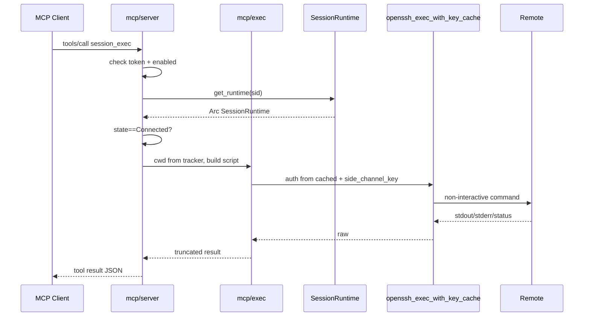

# MCP 复用已连接 SSH 会话 — 功能设计

| 字段 | 内容 |
|------|------|
| **文档标题** | AnchorTerm MCP Server：把已连接会话暴露给 AI 工具 |
| **日期** | 2026-08-04 |
| **状态** | Draft（rev.1.3 — **PR-M1…M5 已实现**：HTTP 工具 + `mcp-stdio` 桥 + 用户文档） |
| **相关代码基线** | `app_state.rs`、`session/mod.rs`、`ssh/openssh.rs`、`ssh/complete.rs`、`lib.rs` |
| **目标读者** | 后端 / 产品；熟悉多会话 `session_id` 与侧信道 exec |
| **仓库副本** | `docs/design-mcp-ssh-sessions.md` |
| **依赖现状** | 多标签多会话、系统 OpenSSH 交互 PTY、侧信道 `openssh_exec`、cwd 跟踪、post-cmd 分隔标记 |

---

## 1. Overview

让 **Claude Desktop / Cursor / 其他 MCP Client** 通过标准 **Model Context Protocol (MCP)** 调用 AnchorTerm 中 **已经建立** 的 SSH 会话：列出会话、查看 cwd/状态、在对应主机上执行命令并拿回结构化输出——而 **不必** 让 AI 自己再管一套主机、密钥与连接。

核心价值一句话：

> **AI 借用用户已经登录好的会话上下文（鉴权 + 主机 + 工作目录），而不是再开一条平行 SSH 宇宙。**

推荐实现路径：

1. **V1**：以 **侧信道 non-interactive exec** 为主（复用 Tab 补全那套 `openssh_exec_with_key_cache`），安全、可结构化、不抢交互 PTY。
2. **V1.5**：可选 **共享交互 PTY** 写入（`submit_line` / 截取近期输出），与人类同屏协作，默认需显式开启。
3. **传输**：进程内 **localhost Streamable HTTP MCP**（主）+ 可选 **stdio 薄桥接进程**（兼容只认 stdio 的 Client）。

---

## 2. Background & Motivation

### 2.1 现状

```
AI 工具 ──(无通道)──×── AnchorTerm ──ssh -tt──► 远端 host
                         │
                         └─ AppState.sessions: HashMap<sid, SessionRuntime>
```

- 用户已在 AnchorTerm 里连好多台机、cwd 已恢复、密钥已解密为临时文件。
- AI 若要「在这台机上查日志 / 改配置」，今天只能：
  - 用户复制粘贴终端内容；或
  - AI 自建 SSH（重复鉴权、无 cwd、无用户当前 tab 语境）。

### 2.2 目标形态

```
┌──────────────────┐     MCP (stdio / Streamable HTTP)     ┌────────────────────┐
│  AI Client       │ ────────────────────────────────────► │  AnchorTerm MCP    │
│  Cursor/Claude…  │ ◄──────────────────────────────────── │  tools + resources  │
└──────────────────┘                                       └─────────┬──────────┘
                                                                     │
                                                          进程内共享 AppState
                                                                     │
                                       ┌─────────────────────────────▼──────────┐
                                       │ SessionRuntime (已 Connected 的 sid)    │
                                       │  · side-channel exec（推荐默认）        │
                                       │  · 可选：交互 PTY write + 输出窗口      │
                                       └────────────────────────────────────────┘
```

### 2.3 为什么值得做

| 痛点 | 本方案收益 |
|------|------------|
| 重复配置主机/密钥 | 复用 HostProfile + 已登录会话 |
| AI 连上后 cwd 不对 | 复用 `CwdTracker` / `last_known` |
| 人类与 AI 各连一条线 | 同一台「工作现场」；侧信道不抢人眼终端 |
| 凭证泄露到 AI 侧配置 | AI **永不** 看到密码/私钥；只拿 `session_id` 句柄 |

### 2.4 对标与差异

| 方案 | 做法 | 与本设计差异 |
|------|------|--------------|
| 通用 SSH MCP（自连） | AI 自带 host/user/key | 不复用「已连接」；凭证进 AI 配置 |
| IDE Remote / Agent | IDE 内置远端 | 不是独立 SSH 客户端；无 AnchorTerm 重连/草稿语境 |
| 纯剪贴板协作 | 人肉中转 | 无结构化工具、无批量 |

本设计绑定 **AnchorTerm 进程内会话表**，定位是「终端客户端的 AI 扩展」，不是「又一个 SSH 库 MCP」。

---

## 3. Goals & Non-Goals

### 3.1 Goals（V1）

1. **MCP Tools**：至少 `list_sessions`、`get_session`、`exec`（侧信道）、`read_output`（可选缓冲）。
2. **仅操作已存在且 Connected 的会话**（按 `session_id`；无全局「当前会话」隐式默认——可提供 **显式 default_session 配置** 作便利，但工具参数仍应能覆盖）。
3. **默认不污染交互 PTY**：`exec` 走侧信道，与 Tab 补全同路。
4. **安全默认**：MCP **默认关闭**；开启后仅 **127.0.0.1**；需 **token**；`ops_log` 审计。
5. **可观测**：每次 tool call 记 `MCP` 类别日志（sid 短前缀、工具名、耗时、结果码；禁密码）。
6. **前端零破坏**：不改现有 `connect`/`submit_line` 语义；MCP 为旁路模块。
7. **Client 可配置**：文档给出 Cursor / Claude Desktop 的 `mcpServers` 样例。

### 3.2 Non-Goals（明确不做）

| 不做 | 原因 |
|------|------|
| V1 新建连接 / 保存密码 / 管理 HostProfile | 鉴权 UI 与 keyring 路径复杂；AI 不应成为第二个会话管理器 |
| V1 完整 SFTP 浏览 UI / 目录树 | 工作量大；**MCP 侧已提供** `session_file_upload` / `session_file_download`（content + scp） |
| 把密钥/密码通过 MCP 返回给 AI | 安全红线 |
| 默认共享交互 PTY 抢打字 | 与人类冲突；V1.5 可选 |
| 保证 TUI（vim/top）可被 AI 可靠驱动 | PTY 屏幕应用不适合作结构化 agent 默认路径 |
| 跨机器 / 公网暴露 MCP | 仅本机 |
| 实现完整 MCP Resources 订阅大屏滚动回放 | V1 用有界 ring buffer 即可 |
| 修改远端 shell 配置 | 与阶段 1 原则一致 |

### 3.3 成功标准（验收级）

1. AnchorTerm 连上 `user@host` 后，开启 MCP，AI 调用 `list_sessions` 能看到该 sid 与 cwd。
2. AI `exec(sid, "pwd")` 返回路径与状态栏 cwd 一致（侧信道在相同用户环境，cwd 用 tracker 注入 `cd` 后执行）。
3. 关闭 MCP 或退出应用后，Client 立即失败且无残留监听端口。
4. 未授权 token 的请求一律拒绝。
5. 用户在终端交互打字时，侧信道 `exec` **不**打断其输入行（不写交互 stdin）。

---

## 4. 关键概念

### 4.1 会话句柄

- 对外 ID 仍为前端 UUID **`session_id`**。
- MCP 另可暴露人类可读标签：`username@host`、tab title（若有）、`state`、`cwd`。
- **禁止**用「焦点 tab」作隐式目标，除非用户在设置中配置了 `mcp.default_session_id` 且工具参数省略 `session_id`。

### 4.2 两条执行通道

| 通道 | 机制 | 适用 | V1 |
|------|------|------|----|
| **A. 侧信道 exec** | `openssh_exec_with_key_cache` + 临时 `cd`/`bash -lc` | 命令结果、巡检、脚本片段 | **默认** |
| **B. 交互 PTY** | `submit_line` / `write_bytes` + 输出捕获 | 与人同屏、需看到 echo 的场景 | V1.5 可选 |

**推荐默认 A**：与「补全不污染 PTY」一致；结果边界清晰；不与人类光标抢 stdin。

### 4.3 侧信道 cwd 语义

侧信道 **不是** 交互 shell 的同一进程，环境变量/`export`/后台 job **不共享**。  
应对策略（与产品诚实预期一致）：

1. 执行前注入：`cd -- 'tracked_cwd' && <user_command>`（路径来自 `CwdTracker.last_known`，必要时 expand `~`）。
2. 文档声明：**仅保证工作目录对齐**；交互 shell 内未导出的变量、未保存的 vim 等 **不对齐**。
3. 若 `last_known` 为空：在 `$HOME` 执行，并在结果中 `warning: cwd_unknown`。

### 4.4 输出捕获（通道 A）

```
timeout → ssh exec → stdout/stderr 合并或分栏 → 截断策略 → MCP tool result
```

- 默认超时：如 **30s**（可参数覆盖，上限如 120s）。
- 输出上限：如 **256 KiB**（超出截断 + `truncated: true`）。
- 退出码：若侧信道能拿到，返回 `exit_code`；拿不到则 `exit_code: null` + raw。

### 4.5 输出捕获（通道 B，V1.5）

交互 PTY 是字节流，无天然「命令结束」。可选策略：

1. **复用 post-cmd separator**（现有 `POST_CMD_SEP_SUFFIX` / `sep_pending`）：`submit_line(..., post_separator=true)`，收集至 marker 或超时。
2. **有界 ring buffer**：每个 session 保留最近 N 行 / M 字节 UI 可见输出，供 `read_output`。
3. **互斥锁**：`mcp_pty_busy` 期间禁止二次 PTY 工具；UI 状态栏显示「AI 正在使用本会话」。

V1 **可不实现 B**，只实现 ring buffer 的只读 `read_output`（从 on_data 旁路采样），降低风险。

---

## 5. 架构设计

### 5.1 模块落点

```
src-tauri/src/
  mcp/
    mod.rs          # 启停、配置、鉴权
    server.rs       # rmcp Streamable HTTP / 工具路由
    tools.rs        # list / get / exec / read_output
    exec.rs         # 侧信道封装（cwd 注入、超时、截断）
    buffer.rs       # 可选 per-session 输出 ring buffer
    config.rs       # 设置读写
  lib.rs            # 启动时按配置拉起 MCP；register 启停 command
```

依赖建议：官方 **`rmcp`**（`server` + streamable-http 相关 feature）+ 现有 `tokio` / `serde_json`。

### 5.2 进程与传输选型

#### 方案对比

| 方案 | 描述 | 优点 | 缺点 |
|------|------|------|------|
| **S1 进程内 HTTP** | AnchorTerm 监听 `127.0.0.1:port` Streamable HTTP | 直读 `AppState`；无第二进程 | 部分 Client 偏好 stdio |
| **S2 独立 stdio 子进程** | AI 拉起 `anchorterm-mcp.exe`，再 IPC 回主程序 | 符合 Claude/Cursor 经典配置 | 需 IPC；主程序未开则失败 |
| **S3 混合（推荐）** | 主程序 S1；附带极薄 **stdio bridge** 把 stdio JSON-RPC 转到 localhost | 兼容面最大 | 多一个小二进制/子命令 |

**推荐 S3**：

- 主路径：设置里「启用 MCP」→ 绑定 `127.0.0.1` 随机或固定端口 + 写入 token 到本机配置。
- 兼容路径：`anchorterm mcp-stdio`（或独立 `anchorterm-mcp`）读同一配置，转发到 HTTP。

Windows 注意：

- 只绑 **IPv4 loopback**；不写 `0.0.0.0`。
- 防火墙提示尽量避免（loopback 通常不弹）。
- 端口冲突：固定默认（如 `39201`）失败则递增并回写实际端口。

### 5.3 生命周期

```
App start
  └─ 读 mcp.enabled
       ├─ false → 不监听
       └─ true  → bind + 生成/加载 token → ops_log MCP start port=…

User toggles MCP off / App quit
  └─ graceful shutdown listener；in-flight tool cancel 或等短超时

Session disconnect / close
  └─ 后续 tool 对该 sid → error session_not_connected / not_found
  └─ ring buffer 随 close_session 释放
```

**disconnect ≠ close** 语义保持：Disconnected 的 Runtime 仍在 map 中，但 `exec` **拒绝**（需 Connected）；`list_sessions` 可展示全部或仅 Connected（建议 list 全量 + `state` 字段，exec 校验 Connected）。

### 5.4 与现有锁 / 会话纯度

遵守 README / ROADMAP 硬边界：

1. 所有工具参数带 **`session_id`**（或解析 default 后填入）。
2. 短持 `sessions` map 锁取 `Arc<SessionRuntime>`，再调 exec。
3. **禁止**持 `cwd` 锁做网络 I/O。
4. 侧信道复用 `side_channel_key` / `control_path`，与补全一致。
5. ops_log **禁止**密码、passphrase、完整私钥路径可按现有脱敏策略。

### 5.5 配置模型

建议路径：`%APPDATA%\AnchorTerm\mcp.json`（与 profiles 并列），或嵌入现有 settings（若尚无统一 settings，优先独立文件，避免误伤 profiles）。

```json
{
  "enabled": false,
  "bind_host": "127.0.0.1",
  "port": 39201,
  "token": "<uuid-v4>",
  "allow_pty_tools": false,
  "default_session_id": null,
  "exec_timeout_secs": 30,
  "exec_max_output_bytes": 262144,
  "allowed_session_ids": null
}
```

| 字段 | 含义 |
|------|------|
| `enabled` | 总开关；UI 菜单「工具 → MCP 服务器」 |
| `token` | `Authorization: Bearer` 或 MCP 握手扩展；首次启用生成 |
| `allow_pty_tools` | V1.5；默认 false |
| `default_session_id` | 省略参数时的便利默认 |
| `allowed_session_ids` | 非 null 时白名单；null = 全部会话 |

**UI**：

- 菜单：启用/停用、显示连接信息（URL + 复制 token / 一键复制 Client 配置 JSON）、打开文档。
- 状态栏或关于对话框显示 `MCP: on :39201`。

---

## 6. MCP 表面：Tools / Resources / Prompts

### 6.1 Tools（V1 必做）

#### `sessions_list`

**描述**：列出 AnchorTerm 中的会话快照。

**参数**：

| 名 | 类型 | 必填 | 说明 |
|----|------|------|------|
| `connected_only` | bool | 否 | 默认 false |

**返回**（JSON text）：

```json
{
  "sessions": [
    {
      "session_id": "…",
      "state": "connected",
      "host": "10.0.0.1",
      "username": "ops",
      "cwd": "/var/log",
      "message": null
    }
  ]
}
```

实现：复用 `AppState::list_snapshots()`。

#### `session_get`

**参数**：`session_id: string`  
**返回**：单条快照；不存在 → MCP error。

#### `session_exec`

**描述**：在指定会话对应主机上 **侧信道** 执行命令；不占用交互 PTY。

**参数**：

| 名 | 类型 | 必填 | 说明 |
|----|------|------|------|
| `session_id` | string | 条件 | 可缺省当配置了 default |
| `command` | string | 是 | 远程 shell 命令（经 `bash -lc` 或等价） |
| `timeout_secs` | number | 否 | 覆盖默认，有上限 |
| `cwd` | string | 否 | 覆盖 tracker cwd；默认用 last_known |

**返回**：

```json
{
  "session_id": "…",
  "cwd_used": "/var/log",
  "exit_code": 0,
  "stdout": "…",
  "stderr": "…",
  "truncated": false,
  "duration_ms": 420,
  "warnings": []
}
```

**错误类**：

| code / message | 条件 |
|----------------|------|
| `not_connected` | state ≠ Connected 或 transport 死 |
| `session_not_found` | map 无 sid |
| `timeout` | 超时杀进程 |
| `forbidden` | 不在 `allowed_session_ids` |
| `mcp_disabled` | 未启用 |

**命令构造（示意）**：

```bash
# 伪代码：与 complete 侧信道一致的 auth/mux
cd -- '$CWD' && bash -lc '$COMMAND'
```

安全注意：

- **不要**对 `command` 做「智能拦截 rm -rf」当唯一防线（易绕过）；依赖本机 token + 用户知情启用。
- 可选 V1.1：`dangerous_patterns` 警告写入 `warnings`，仍执行（或配置 `require_confirm`——桌面确认框，AI 同步调用会卡住，需谨慎）。

#### `session_read_output`（V1 建议做最小版）

**描述**：读取该会话近期终端输出（ring buffer），供 AI 理解人类刚做了什么。

**参数**：`session_id`、`max_bytes`（可选）  
**返回**：`{ "text": "…", "truncated": bool }`  
数据来源：`on_data` 旁路写入 buffer（注意 **ui_mute** 期间是否写入：建议 mute 时仍可选记 raw 或跳过——默认跳过 mute，与用户可见一致）。

### 6.2 Tools（V1.5 可选）

| Tool | 说明 |
|------|------|
| `session_submit_line` | 写入交互 PTY 一行并尽量等 separator |
| `session_write_raw` | 原始字节（Ctrl+C 等） |
| `session_interrupt` | 发送 `0x03` |

均受 `allow_pty_tools` 门控。

### 6.3 Resources（可选，V1 可后置）

| URI | 内容 |
|-----|------|
| `anchorterm://sessions` | 会话列表 JSON |
| `anchorterm://session/{id}` | 单会话快照 |
| `anchorterm://session/{id}/output` | 近期输出 |

Tools 优先：多数 Agent 对 tools 支持更好。

### 6.4 Prompts（可选）

- `diagnose_host`：引导 AI 先 `session_get` 再分步 `exec`。
- 非必须。

---

## 7. 安全设计

### 7.1 威胁模型（简）

| 威胁 | 缓解 |
|------|------|
| 本机恶意进程调 MCP | Bearer token；token 文件 ACL 仅用户可读 |
| 误绑公网 | 强制 127.0.0.1；启动校验 |
| AI 误跑破坏性命令 | 默认侧信道 + 审计日志；可选警告；用户可关 MCP / 白名单 sid |
| 凭证经 MCP 泄露 | 工具永不返回 secret；list 不含 key 路径 |
| 日志敏感 | ops_log 沿用禁明文规则；command 可截断预览 |

### 7.2 鉴权

- HTTP：`Authorization: Bearer <token>`（或 query **禁止**，防进历史）。
- stdio bridge：仅本机子进程，可从配置文件读 token 自动带上。
- 首次启用生成 UUID token；UI 提供「重新生成」（使旧 Client 失效）。

### 7.3 能力分级

```
L0  关闭（默认）
L1  只读：list / get / read_output
L2  侧信道 exec（V1 目标默认启用级别，仍需 enabled=true）
L3  交互 PTY 写入（allow_pty_tools）
```

可用配置 `max_capability: "exec" | "read_only" | "pty"` 一次收紧。

### 7.4 审计

`ops_log` 类别 **`MCP`**：

```
MCP start port=39201
MCP tool=session_exec sid=abcd1234 ok exit=0 ms=420 out_len=120
MCP tool=session_exec sid=abcd1234 err=not_connected
MCP deny bad_token
MCP stop
```

---

## 8. 前端 / UX

| 入口 | 行为 |
|------|------|
| 菜单「工具 → MCP 服务器…」 | 对话框：开关、端口、token 显示/复制、复制 Cursor 配置、能力级别 |
| 会话 tab | 可选小图标表示「允许被 MCP 使用」（若用白名单 UI） |
| 状态 | MCP on 时 menubar 旁提示 |

**复制给 Client 的配置示例（Cursor）**：

```json
{
  "mcpServers": {
    "anchorterm": {
      "url": "http://127.0.0.1:39201/mcp",
      "headers": {
        "Authorization": "Bearer <token>"
      }
    }
  }
}
```

（具体 path/header 以所选 `rmcp` Streamable HTTP 约定为准；文档随实现校对。）

stdio 变体：

```json
{
  "mcpServers": {
    "anchorterm": {
      "command": "C:\\Path\\to\\anchorterm.exe",
      "args": ["mcp-stdio"]
    }
  }
}
```

前提：主程序已运行且 MCP 已启用；否则 bridge 返回明确错误「请先打开 AnchorTerm 并启用 MCP」。

---

## 9. 数据流（关键路径）

### 9.1 session_exec



### 9.2 与交互路径隔离

- **不**调用 `write_stdin`（V1）。
- **不**触发 `ui_mute` / restore playbook。
- 可与用户同时 `submit_line` 并行；侧信道独立 TCP（或 ControlMaster 复用连接但不共享 shell 进程）。

---

## 10. 错误与边界情况

| 场景 | 行为 |
|------|------|
| 重连中 Reconnecting | `not_connected`，message 提示稍后 |
| 手动断开 Disconnected | 同上 |
| 关 tab | `session_not_found` |
| 交互在 TUI/alt-screen | 侧信道仍可 exec；`read_output` 可能是乱码/控件序列——可 strip 或原样 + warning |
| Windows 无 ControlMaster | exec 每次独立鉴权，慢但正确；与补全一致 |
| 超大输出 | 截断 + truncated |
| 并发多个 exec 同 sid | 允许有界并发（如 2）；过多排队或拒绝 `busy` |
| 应用最小化/托盘 | MCP 仍服务（进程在即可） |

---

## 11. 测试计划

### 11.1 单元 / 集成（Rust）

- `exec` 脚本拼接：cwd 含空格/单引号转义。
- 截断逻辑、超时 mock。
- token 中间件拒绝/通过。
- `allowed_session_ids` 过滤。

### 11.2 手动验收

1. 双 tab 两主机 → `sessions_list` 两条。  
2. `cd /tmp` 后 `session_exec pwd` → `/tmp`。  
3. 人类在终端 `sleep 60` 时 `session_exec echo ok` 仍成功且不打乱 sleep（侧信道）。  
4. 断开会话后 exec 失败信息明确。  
5. 错误 token → 401/MCP error。  
6. 关闭 MCP → 端口释放。  
7. （若做 bridge）仅开 Client 不启主程序 → 友好错误。

### 11.3 回归

- 现有连接 / 重连 / Tab 补全 / 多 tab 不受影响。  
- `cargo test -p anchorterm --lib`。

---

## 12. PR 切片建议

| PR | 内容 | 风险 |
|----|------|------|
| **PR-M1** | `mcp` 模块骨架：config、启停、localhost bind、token、菜单开关、ops_log | ✅ |
| **PR-M2** | `sessions_list` / `session_get` + JSON-RPC `tools/*` | ✅（自研 HTTP JSON-RPC，未绑 rmcp） |
| **PR-M3** | `session_exec` 侧信道 + 超时截断 + 单测 | ✅ `openssh_exec_raw` + `mcp/exec.rs` |
| **PR-M4** | `session_read_output` ring buffer（on_data 挂钩） | ✅ `output_ring.rs`，非 mute 路径写入 |
| **PR-M5** | stdio bridge + 用户文档（INSTALL/README 小节） | ✅ `mcp-stdio`、`mcp.runtime.json`、[mcp-user-guide.md](mcp-user-guide.md) |
| **PR-M6** | （可选）PTY tools + UI「AI 使用中」 | 高，单独评审 |

原则：**M1–M3 即可形成最小可用**；不与 Jump/SFTP/分屏同 PR。

---

## 13. 实现要点（给开工会话）

1. **优先侧信道**，不要一上来劫持 PTY。  
2. **复用** `openssh_exec_with_key_cache` 与 session 上的 `side_channel_key` / `cached` ConnectParams；缺 cached 时无法侧信道 → 明确错误。  
3. cwd：只读 `CwdTracker` clone，再拼命令。  
4. 鉴权材料来自 `CachedConnect`（内存），**不要**新开 UI 要密码。  
5. Tauri command 仅用于「启停/读配置/复制信息」；业务 tool 在 MCP 线程直接碰 `AppState`（`app.try_state` / `Manager`）。  
6. 锁顺序与 `complete_draft` 对齐。  
7. 协议实现跟 `rmcp` 当前 docs，Streamable HTTP path 以 SDK 为准写进用户文档。

### 13.1 CachedConnect 完备性

侧信道需要 host/port/user/auth。这些已在 connect 成功路径写入 `rt.cached`。  
若未来存在 Connected 但 cached 为空的边角，exec 应失败而非半连接。

### 13.2 与 ControlMaster

若日后 Windows 打开 mux，exec 与交互共享连接、加速明显；API 不变。

---

## 14. 文档交付物

| 文档 | 说明 |
|------|------|
| 本文 | 设计真相源 |
| `docs/mcp-user-guide.md`（实现时） | 用户如何开 MCP、配 Cursor/Claude |
| README 功能列表 + 路线图勾选 | 实现后更新 |
| `docs/ROADMAP-NEXT.md` | 可增「MCP 会话桥」条目 |

---

## 15. 开放问题（评审拍板）

| # | 问题 | 建议默认 |
|---|------|----------|
| Q1 | V1 是否包含 `read_output`？ | **包含**最小 ring buffer，AI 才有「现场感」 |
| Q2 | 是否允许省略 `session_id`？ | 仅当配置了 `default_session_id` |
| Q3 | `session_exec` 用 login shell 还是 non-login？ | non-login `bash -lc`，更快；文档说明 PATH 差异 |
| Q4 | 多 Client 同时连？ | 允许；共享同一 token |
| Q5 | 是否要「每次 exec 桌面确认」？ | V1 **否**（太吵）；靠开关 + 白名单 |
| Q6 | stdio bridge 独立 exe 还是主程序子命令？ | **主程序子命令** `mcp-stdio`，少产物 |
| Q7 | Resources 是否 V1？ | **否**，Tools 足够 |

---

## 16. 总结

| 维度 | 结论 |
|------|------|
| 产品 | 把「已连接 SSH 会话」变成 AI 可调用的 MCP 工具面 |
| 技术 | 进程内 MCP + 侧信道 exec 复用 OpenSSH 鉴权；可选 stdio 桥 |
| 安全 | 默认关、loopback、token、审计、不泄凭证 |
| 边界 | 不做新建连接/SFTP/默认抢 PTY；cwd 对齐非完整 shell 态共享 |
| 落地 | PR-M1…M3 最小可用，再缓冲与 bridge |

**一句话**：AnchorTerm 继续做人的终端；MCP 让 AI **安全地借用同一套已登录会话**，默认走侧信道，像「可编程的 Tab 补全通道」升级为「可编程的运维通道」。

---

## 17. 相关文档

| 文档 | 关系 |
|------|------|
| [../DESIGN.md](../DESIGN.md) | 总架构与阶段 |
| [ROADMAP-NEXT.md](ROADMAP-NEXT.md) | 后续能力；本文可作为新方向补丁 |
| [UI-MULTI-TAB.md](UI-MULTI-TAB.md) | session_id 纯度 |
| [design-hybrid-tab-complete-cache.md](design-hybrid-tab-complete-cache.md) | 侧信道与缓存范式 |
| [shell-integration.md](shell-integration.md) | cwd 来源 |
| [../README.md](../README.md) | 会话沉淀与硬边界 |

---

*本文为功能设计 Draft；实现前请确认 §15 开放问题，并按 §12 切片开工。*
